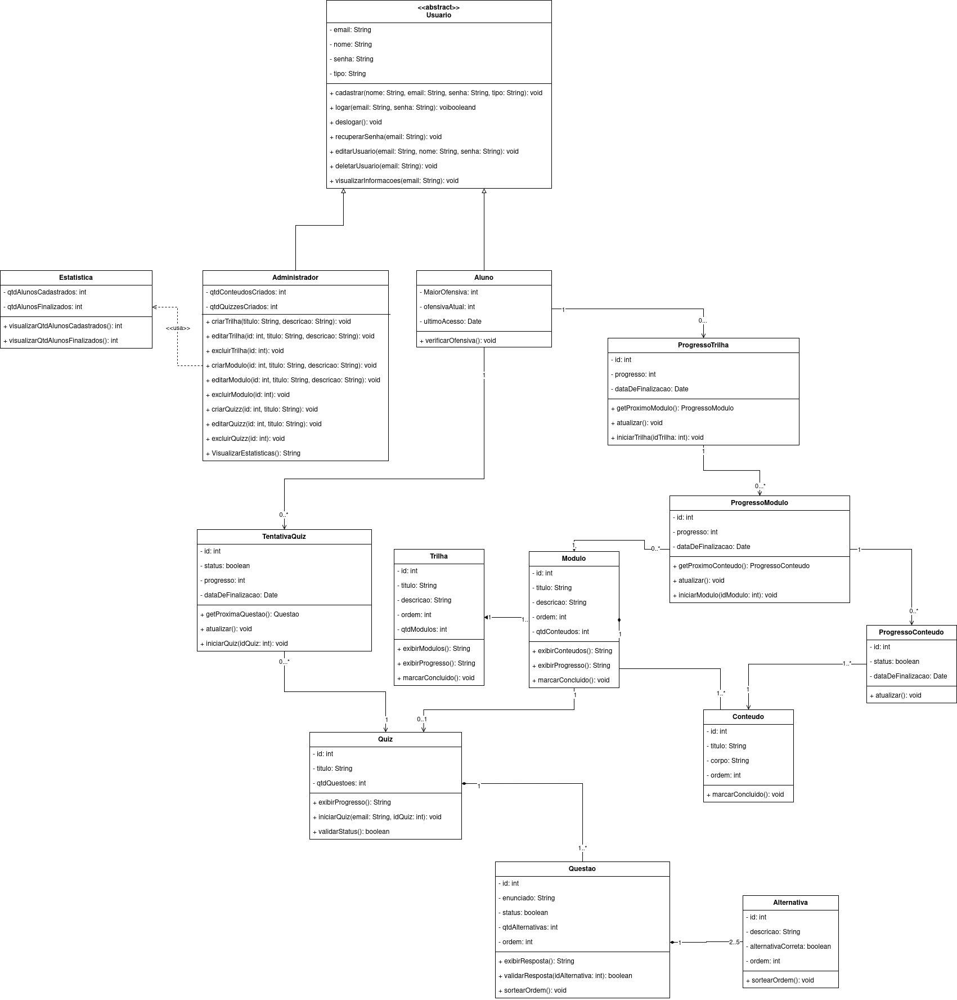

# Diagrama de classes

## Participantes

Os participantes da elaboração do diagrama de classes estão descritos na tabela a seguir:

Tabela 1: Participantes da elaboração do Diagrama de classes

| Matrícula | Aluno              |
| --------- | ------------------ |
| 231027032 | Arthur Oliveira    |
| 190042303 | Carlos Nascimento  |
| 231026699 | Eduarda Rodrigues  |
| 231037692 | Isabella Choukaira |
| 231035455 | Leticia Jesus      |
| 200067095 | Lucas Avelar       |
| 231038303 | Yan Aguiar         |
| 231012316 | Yasmin Nascimento  |

## 1. Introdução

O diagrama de classes é definido como um dos principais diagramas estruturais da UML, sendo utilizado para representar a estrutura estática de um sistema. O diagrama de classes é um diagrama estrutural da UML que mostra a estrutura do sistema projetado no nível de classes e interfaces, apresentando suas características, restrições e relacionamentos – como associações, generalizações e dependências (Fakhroudtinov, 2009). Esse modelo possibilita enxergar como o software se organiza em componentes lógicos, o que torna mais clara a compreensão do funcionamento interno da aplicação.

Os diagramas de classes, além de apoiar a definição da arquitetura em sistemas orientados a objetos, fornecem a base para a implementação dos componentes, favorecendo a padronização e o reaproveitamento de código. Dependendo da complexidade do sistema, pode-se adotar um único diagrama para representar toda a estrutura ou fragmentá-lo em seções menores, abordando subsistemas específicos, sempre buscando incluir as específicas formas de relacionamento entre as classes, bem como os atributos individuais.

No decorrer do desenvolvimento, esse tipo de diagrama evolui desde versões conceituais, voltadas à análise de requisitos, até descrições mais detalhadas, próximas da estrutura efetiva do código. Sua aplicação contribui para maior clareza no design, consistência na modelagem e melhor comunicação entre os integrantes da equipe, visando sempre, dessa forma, aumentar a qualidade do projeto.

# Diagrama

Figura 1: Diagrama de classes ConhecendoRequisitos

- Usuário (classe abstrata): Representa a entidade base de todos os usuários do sistema. Armazena atributos comuns como e-mail, nome, senha e tipo de usuário. Define operações genéricas de autenticação e gerenciamento de conta, como cadastrar, logar, deslogar, recuperar senha, editar dados, deletar usuário e visualizar informações. Serve como superclasse para Aluno e Administrador.

- Administrador: Especialização de Usuário responsável pela gestão da plataforma. Possui atributos relacionados à quantidade de conteúdos e quizzes criados. Oferece métodos para criar, editar e excluir trilhas, módulos e quizzes, além de visualizar estatísticas do sistema. Está associado à classe Estatística, da qual depende para obter dados analíticos.

- Aluno: Especialização de Usuário que representa os estudantes da plataforma. Contém atributos como ofensiva atual, maior ofensiva e último acesso. Possui método para verificar ofensiva (streak de estudos). Está associado ao progresso em trilhas e quizzes, sendo o principal ator no consumo de conteúdo.

- Estatística: Responsável por armazenar e fornecer dados quantitativos da plataforma, como número de alunos cadastrados e alunos que finalizaram trilhas. Disponibiliza métodos para visualização dessas informações, sendo utilizada pelo Administrador.

- Trilha: Modela um caminho de aprendizado estruturado. Possui atributos como título, descrição, ordem e quantidade de módulos. Inclui métodos para exibir módulos, exibir progresso e marcar a trilha como concluída. Está associada a vários módulos e pode conter quizzes.

- Módulo: Representa uma unidade dentro de uma trilha. Contém atributos como título, descrição, ordem e quantidade de conteúdos. Possui métodos para exibir conteúdos, exibir progresso e marcar o módulo como concluído. Está associado a conteúdos, quizzes e ao progresso do aluno.

- Conteúdo: Modela o material educacional apresentado ao aluno, com atributos como título, corpo do conteúdo e ordem. Possui método para marcar o conteúdo como concluído. Está diretamente ligado ao progresso de conteúdo do aluno.

- Quiz: Representa uma avaliação associada a uma trilha ou módulo. Contém atributos como título e quantidade de questões. Disponibiliza métodos para iniciar o quiz, exibir progresso e validar status de conclusão. Está associado a questões e às tentativas realizadas pelos alunos.

- Questão: Modela uma pergunta de um quiz. Possui enunciado, status, quantidade de alternativas e ordem. Inclui métodos para exibir resposta, validar resposta do aluno e sortear ordem das alternativas. Está associada a múltiplas alternativas.

- Alternativa: Representa as opções de resposta de uma questão. Contém descrição, indicador de alternativa correta e ordem. Possui método para sortear a ordem, garantindo variação na apresentação das respostas.

- TentativaQuiz: Registra a interação do aluno com um quiz. Armazena status, progresso e data de finalização. Possui métodos para iniciar o quiz, atualizar progresso e obter a próxima questão.

- ProgressoTrilha: Controla o avanço do aluno em uma trilha específica. Armazena progresso geral e data de finalização. Possui métodos para iniciar a trilha, atualizar progresso e obter o próximo módulo. Está associado ao progresso de módulos.

- ProgressoModulo: Gerencia o progresso do aluno dentro de um módulo. Contém informações de progresso e data de finalização. Inclui métodos para iniciar módulo, atualizar progresso e obter o próximo conteúdo. Está associado ao progresso de conteúdos.

- ProgressoConteudo: Representa o acompanhamento da conclusão de conteúdos individuais. Possui status e data de finalização, além de método para atualização do progresso.

# Senso crítico e trabalho em equipe

Na elaboração do Diagrama de Classes, o principal exercício de senso crítico foi transformar requisitos funcionais em estruturas de domínio coesas, evitando excesso de classes ou responsabilidades sobrepostas. A equipe discutiu escolhas de abstração, como a classe abstrata `Usuario`, e refinou associações entre trilhas, módulos, conteúdos e progresso para garantir que o modelo representasse o comportamento esperado do sistema sem perder legibilidade.

O trabalho em equipe ocorreu de forma iterativa, com contribuições distribuídas entre levantamento de entidades, validação de relacionamentos e revisão da consistência entre atributos e métodos. Esse processo colaborativo fortaleceu o alinhamento conceitual do grupo e resultou em um diagrama mais estável para apoiar etapas seguintes de modelagem e implementação.

# Conclusão

O diagrama de classes desenvolvido apresenta uma visão clara, organizada e consistente da arquitetura da plataforma educacional, evidenciando os principais componentes do sistema e os relacionamentos existentes entre usuários, trilhas, conteúdos, avaliações e mecanismos de progresso. Essa modelagem contribuiu diretamente para a compreensão do domínio da aplicação, servindo como base conceitual para o planejamento e a implementação das funcionalidades propostas.

A definição das entidades Usuário, Aluno, Administrador, Trilha, Módulo, Conteúdo, Quiz e das classes de progresso reflete de forma fiel os requisitos funcionais levantados, permitindo representar o fluxo de aprendizagem do aluno e as responsabilidades administrativas do sistema. Além disso, a adoção de abstrações, especializações e boas práticas da UML favorece a organização, a manutenibilidade e a escalabilidade da solução, auxiliando a equipe durante todo o ciclo de desenvolvimento e facilitando futuras evoluções da plataforma

# Referências

- KIRILL FAKHROUTDINOV. UML Class and Object Diagrams Overview - common types of UML structure diagrams. Disponível em: https://www.uml-diagrams.org/class-diagrams-overview.html. Acesso em 20 de setembro de 2025.

- SERRANO, Milene, Arquitetura e Desenho de Software - Aula - Modelagem UML Estática. Disponível em: https://aprender3.unb.br/pluginfile.php/3178533/mod_page/content/1/Arquitetura%20e%20Desenho%20de%20Software%20-%20Aula%20Modelagem%20UML%20Est%C3%A1tica%20-%20Profa.%20Milene.pdf. Universidade de Brasília - UnB. Brasília. Acesso em 20 de setembro de 2025.

## Histórico de versões

| Versão | Data  | Descrição                                              | Autor                                              | Revisor                                                    | Detalhes da revisão |
| ------ | ----- | ------------------------------------------------------ | -------------------------------------------------- | ---------------------------------------------------------- | ------------------- |
| 1.0    | 18/04 | Criação do documento                                   | [Yan Matheus](https://github.com/Yanmatheus0812)   | [Isabella Choukaira](https://github.com/isabellachoukaira) | Documento criado    |
| 1.1    | 18/04 | Correção no Diagrama que estava em uma versão anterior | [Arthur Evangelista](https://github.com/arthurevg) | [Isabella Choukaira](https://github.com/isabellachoukaira) | Revisado e aprovado |
