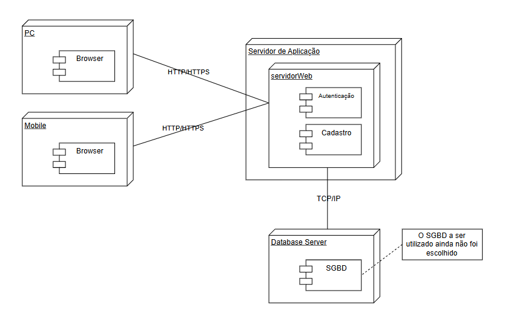

# 2.1.3. Diagrama de Implantação

## Participantes

Os participantes da elaboração desta página estão descritos na tabela a seguir:

Tabela 1: Participantes da elaboração do documento

| Matrícula  | Aluno              |
| ---------- | ------------------ |
| 222006650  | Davi Sousa         |
| 231026699  | Eduarda Rodrigues  |
| 231037692  | Isabella Choukaira |
| 200067095  | Lucas Avelar       |
| 231012316  | Yasmin Nascimento  |

---

## Introdução

O diagrama de implantação, conforme definido pela UML (Unified Modeling Language), tem como finalidade modelar a arquitetura física de um sistema, evidenciando como os artefatos de software são distribuídos nos diferentes nós de hardware (UML-DIAGRAMS, 2026). Esse tipo de diagrama organiza visualmente os dispositivos envolvidos, como computadores, servidores e dispositivos móveis, além dos caminhos de comunicação entre eles.

Por ser independente de tecnologias específicas, o diagrama de implantação pode ser utilizado em diversos contextos, como sistemas web, distribuídos e corporativos. Sua principal utilidade é demonstrar onde cada componente do sistema será executado e como ocorre a comunicação entre eles.

Neste projeto, o diagrama de implantação representa a arquitetura física da solução proposta para o sistema, evidenciando como os componentes da aplicação são distribuídos na infraestrutura e como ocorre a interação entre clientes, servidor de aplicação e servidor de banco de dados.

---

## Objetivo

O diagrama de implantação tem como objetivo representar os elementos físicos de um sistema e as conexões entre eles, permitindo compreender como os componentes de software são distribuídos na infraestrutura (UML-DIAGRAMS, 2026).

Neste sistema, ele evidencia a interação entre dispositivos clientes (PC e Mobile), o servidor de aplicação e o servidor de banco de dados, destacando os protocolos de comunicação utilizados, bem como a separação entre as camadas de apresentação, aplicação e dados.

---

## Metodologia

A construção do diagrama seguiu as diretrizes da UML, utilizando uma notação padronizada para representar os nós físicos, os artefatos implantados e as conexões entre os elementos do sistema. Para a modelagem, foi utilizada a ferramenta draw.io, permitindo a representação visual da arquitetura e da distribuição dos componentes de software na infraestrutura.

Além disso, a elaboração do diagrama considerou a organização lógica do sistema em camadas, de modo a facilitar a compreensão da arquitetura proposta e apoiar futuras decisões de implementação.

---

## Diagrama de Implantação

**Figura 1: Diagrama de Implantação do Sistema**

Fonte: Elaborado pela equipe (2026)

---

## Descrição

O diagrama de implantação do sistema é composto pelos seguintes elementos principais:

### Dispositivos Cliente (PC e Mobile)

Representam os dispositivos utilizados pelos usuários para acessar o sistema. Ambos utilizam um navegador web (browser) como interface de acesso, possibilitando a interação com as funcionalidades da aplicação por meio da internet. Esses dispositivos compõem a camada de apresentação do sistema.

### Servidor de Aplicação (Web Server)

O servidor de aplicação é responsável por processar as requisições enviadas pelos usuários, executar as regras de negócio e intermediar a comunicação com o banco de dados. Nesse servidor estão implantados os principais módulos funcionais do sistema, como **Autenticação** e **Cadastro**, que representam funcionalidades essenciais da aplicação.

Esse nó corresponde à camada de aplicação da arquitetura, concentrando a lógica responsável pelo funcionamento do sistema.

### Servidor de Banco de Dados (Database Server)

O servidor de banco de dados é responsável pela persistência e gerenciamento das informações da aplicação. Nele está implantado o Sistema Gerenciador de Banco de Dados (SGBD), ainda não definido pela equipe. No entanto, considera-se a utilização de soluções amplamente adotadas em sistemas web, como PostgreSQL ou MySQL, devido à confiabilidade e ao suporte a aplicações escaláveis.

Esse nó representa a camada de dados da arquitetura.

### Artefatos Implantados

Os principais artefatos implantados no sistema são:

- Aplicação Web acessada pelos dispositivos clientes;
- Módulos funcionais de **Autenticação** e **Cadastro**;
- Sistema gerenciador de banco de dados responsável pelo armazenamento persistente das informações.

### Comunicação Cliente-Servidor

A comunicação entre os dispositivos cliente e o servidor de aplicação ocorre por meio do protocolo **HTTPS**, garantindo maior segurança, confidencialidade e integridade na troca de dados entre os usuários e o sistema.

Essa comunicação caracteriza uma arquitetura web baseada no modelo cliente-servidor, em que os clientes consomem os serviços disponibilizados pela aplicação centralizada no servidor.

### Comunicação entre Servidores

A comunicação entre o servidor de aplicação e o servidor de banco de dados ocorre por meio de conexões baseadas em **TCP/IP**, permitindo a realização de operações de persistência, como criação, leitura, atualização e exclusão de dados.

Em termos arquiteturais, essa interação assegura a separação de responsabilidades entre a lógica do sistema e o armazenamento das informações, contribuindo para maior organização e manutenção da solução.

### Arquitetura Representada

A arquitetura representada no diagrama segue o modelo **cliente-servidor em três camadas**, organizado da seguinte forma:

- **Camada de apresentação:** dispositivos cliente PC e Mobile, acessando o sistema via navegador;
- **Camada de aplicação:** servidor web responsável pela lógica de negócio;
- **Camada de dados:** servidor de banco de dados responsável pelo armazenamento persistente das informações.

Essa organização favorece a clareza estrutural do sistema e facilita futuras evoluções tecnológicas.

---

## Senso Crítico e Trabalho em Equipe

A elaboração do diagrama foi realizada de forma colaborativa, considerando os principais componentes necessários para o funcionamento do sistema e a melhor forma de distribuí-los em uma arquitetura coerente. A equipe analisou os elementos essenciais da solução e definiu as conexões entre eles com o objetivo de garantir clareza, organização e consistência com o contexto do projeto.

Optou-se por uma arquitetura centralizada, baseada no modelo cliente-servidor, por se tratar de uma solução compatível com o porte e a complexidade do sistema proposto. Essa decisão contribui para simplificar o desenvolvimento, a manutenção e a compreensão da infraestrutura por parte da equipe.

Além disso, houve uma preocupação em representar corretamente os protocolos de comunicação e as responsabilidades de cada camada do sistema, assegurando uma arquitetura adequada ao contexto atual do projeto. Ainda assim, a equipe reconhece que, em cenários futuros de maior escalabilidade ou aumento da demanda, a solução poderá evoluir para arquiteturas mais distribuídas, com maior desacoplamento entre serviços.

---

## Conclusão

O diagrama de implantação permite visualizar de forma clara a infraestrutura física do sistema, evidenciando a interação entre os dispositivos cliente, o servidor de aplicação e o servidor de banco de dados.

Sua utilização facilita o entendimento da arquitetura, auxilia na tomada de decisões técnicas e contribui para a organização do desenvolvimento do sistema. Além disso, o diagrama serve como base para futuras evoluções arquiteturais, como a adoção de serviços em nuvem, melhorias de escalabilidade e aperfeiçoamento da infraestrutura da aplicação.

---

## Referências

> UML-DIAGRAMS. **Deployment Diagrams Overview**. Disponível em: http://uml-diagrams.org/deployment-diagrams-overview.html. Acesso em: 19 abr. 2026.

> YOUTUBE. **Diagrama de Implantação UML (Deployment Diagram)**. Disponível em: https://www.youtube.com/watch?v=DgERD0HgggQ. Acesso em: 19 abr. 2026.

---

## Histórico de versões

| Versão | Data       | Descrição                                                                 | Autor(es)                                                                 | Revisor(es)                                                                 | Detalhes da Revisão     |
| ------ | ---------- | ------------------------------------------------------------------------- | ------------------------------------------------------------------------- | --------------------------------------------------------------------------- | ----------------------- |
| 1.0    | 07/04/2026 | Criação do documento do diagrama de implantação                          | [Yan Matheus](https://github.com/Yanmatheus0812)                          | [Isabella Choukaira](https://github.com/isabellachoukaira)                  | Documento criado        |
| 1.1    | 19/04/2026 | Ajuste de nomenclatura: "Implementação" → "Implantação"                  | [Yasmin Nascimento](https://github.com/Yasm1nNasc1mento)                  | [Isabella Choukaira](https://github.com/isabellachoukaira)                  | Revisado e aprovado     |