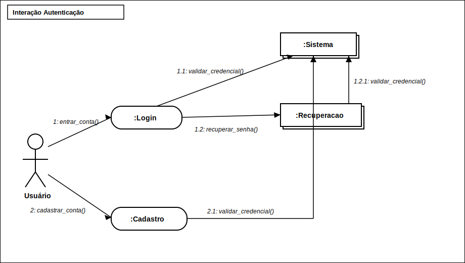
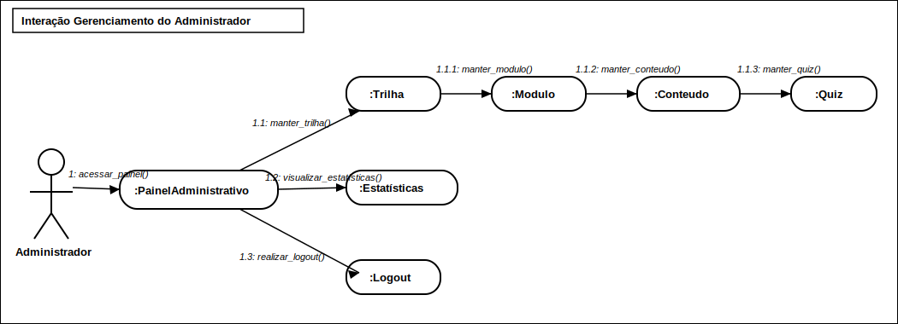
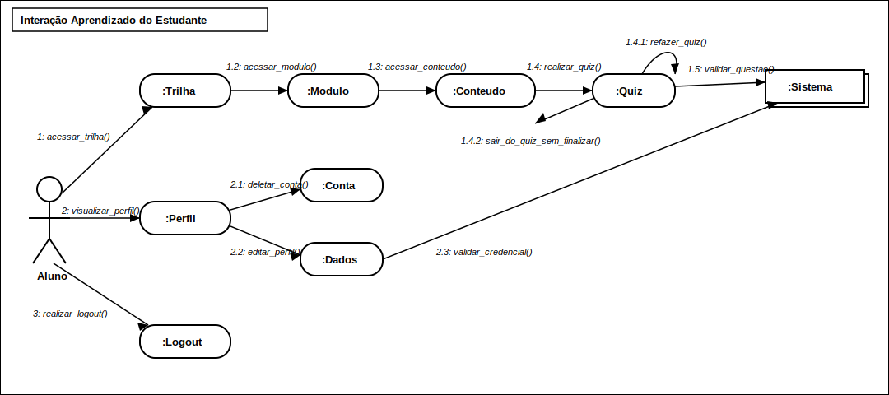

# 2.2.1. Diagrama de Colaboração (Comunicação)

## 1. Introdução

O Diagrama de Colaboração, também chamado de Diagrama de Comunicação a partir da UML 2.0, é um tipo de diagrama de interação que tem como objetivo representar a troca de mensagens entre objetos dentro de um determinado contexto de execução. Ao contrário do Diagrama de Sequência, que enfatiza a ordem temporal das mensagens, o Diagrama de Colaboração prioriza a organização estrutural dos objetos participantes e os vínculos (links) através dos quais as mensagens são transmitidas (BOOCH; RUMBAUGH; JACOBSON, 2005).

De acordo com Sommerville (2011), os diagramas de interação são fundamentais para capturar o comportamento dinâmico de um sistema, pois permitem compreender como os objetos cooperam entre si para realizar determinada funcionalidade. O Diagrama de Colaboração se destaca quando o objetivo é evidenciar as responsabilidades de cada objeto e o caminho percorrido pelas mensagens durante a execução de um caso de uso.

No contexto do sistema ConhecendoRequisitos, uma plataforma educacional gamificada voltada ao ensino de Engenharia de Requisitos, foram elaborados três Diagramas de Colaboração que representam as interações centrais do sistema:

1. **Interação de Autenticação**: contempla o fluxo de login, cadastro e recuperação de senha;
2. **Interação de Gerenciamento do Administrador**: abrange a manutenção de trilhas, módulos, conteúdos, quizzes e a visualização de estatísticas;
3. **Interação de Aprendizado do Estudante**: compreende a navegação pelas trilhas, a realização de quizzes, o gerenciamento de perfil e o logout.

Cada diagrama apresenta os objetos participantes, os vínculos existentes entre eles e as mensagens numeradas que descrevem o fluxo de operação, seguindo a notação padronizada da UML.

## 2. Participantes

Os participantes da elaboração do Diagrama de Colaboração estão descritos na tabela a seguir:

Tabela 1: Participantes da elaboração do Diagrama de Colaboração

| Matrícula | Aluno              |
| --------- | ------------------ |
| 190042303 | Carlos Nascimento  |
| 231037692 | Isabella Choukaira |
| 200067095 | Lucas Avelar       |
| 231038303 | Yan Aguiar         |

## 3. Metodologia

A construção dos Diagramas de Colaboração seguiu uma abordagem estruturada, fundamentada nas práticas de modelagem UML descritas por Pressman (2016) e Booch, Rumbaugh e Jacobson (2005).

### Etapa 1: Identificação dos fluxos

Com base nos casos de uso documentados (seção 2.3.1) e no diagrama de classes (seção 2.1.2), foram selecionados os três fluxos de interação mais representativos do sistema, contemplando os perfis de Usuário, Administrador e Aluno.

### Etapa 2: Mapeamento dos objetos

Para cada fluxo, os objetos participantes foram extraídos a partir das classes definidas no diagrama de classes, respeitando a arquitetura estabelecida no diagrama de componentes (seção 2.1.1).

### Etapa 3: Definição das mensagens

As mensagens foram numeradas de forma hierárquica (por exemplo: 1, 1.1, 1.1.1) para indicar a sequência e o aninhamento das chamadas. Cada mensagem corresponde a uma operação presente nas classes do sistema.

### Etapa 4: Modelagem e revisão

Os diagramas foram construídos de forma colaborativa pela equipe e exportados em formato SVG. Após a modelagem inicial, foi feita uma revisão para garantir a consistência com os demais artefatos do projeto.

## 4. Diagramas

### 4.1. Diagrama de Colaboração: Interação Autenticação

Figura 1: Diagrama de Colaboração, Interação Autenticação

Fonte: Elaborado pela equipe (2026)

#### 4.1.1. Componentes

| Elemento      | Tipo   | Descrição                                                            |
| ------------- | ------ | -------------------------------------------------------------------- |
| Usuário       | Ator   | Usuário não autenticado que deseja acessar a plataforma              |
| Login         | Objeto | Componente responsável por receber e processar credenciais de acesso |
| Cadastro      | Objeto | Componente que gerencia o registro de novos usuários na plataforma   |
| Recuperacao   | Objeto | Componente responsável pelo fluxo de recuperação de senha            |
| Sistema       | Objeto | Serviço interno de validação de credenciais e autenticação           |

#### 4.1.2. Fluxo passo a passo

| Nº Mensagem | Mensagem             | Origem      | Destino     | Descrição                                                                                    |
| ----------- | -------------------- | ----------- | ----------- | -------------------------------------------------------------------------------------------- |
| 1           | entrar_conta()       | Usuário     | Login       | O usuário informa suas credenciais (e-mail e senha) para realizar o login                    |
| 1.1         | validar_credencial() | Login       | Sistema     | O componente de login encaminha as credenciais para validação pelo sistema                    |
| 1.2         | recuperar_senha()    | Login       | Recuperacao | Caso o usuário não lembre a senha, o login redireciona para o fluxo de recuperação           |
| 1.2.1       | validar_credencial() | Recuperacao | Sistema     | A recuperação solicita ao sistema a validação do e-mail informado para envio de redefinição   |
| 2           | cadastrar_conta()    | Usuário     | Cadastro    | O usuário opta por criar uma nova conta, preenchendo os dados solicitados                    |
| 2.1         | validar_credencial() | Cadastro    | Sistema     | O cadastro solicita ao sistema a validação dos dados informados (e-mail único, senha válida) |

---

### 4.2. Diagrama de Colaboração: Interação Gerenciamento do Administrador

Figura 2: Diagrama de Colaboração, Interação Gerenciamento do Administrador

Fonte: Elaborado pela equipe (2026)

#### 4.2.1. Componentes

| Elemento             | Tipo   | Descrição                                                                    |
| -------------------- | ------ | ---------------------------------------------------------------------------- |
| Administrador        | Ator   | Usuário com privilégios de gestão da plataforma                              |
| PainelAdministrativo | Objeto | Interface central de gerenciamento, ponto de entrada para todas as operações |
| Trilha               | Objeto | Componente que representa os caminhos de aprendizagem da plataforma          |
| Modulo               | Objeto | Unidade organizacional dentro de uma trilha                                  |
| Conteudo             | Objeto | Material educacional (texto, vídeo) pertencente a um módulo                  |
| Quiz                 | Objeto | Avaliação composta por questões, associada a módulos ou trilhas              |
| Estatísticas         | Objeto | Componente responsável por dados analíticos e métricas da plataforma         |
| Logout               | Objeto | Componente que gerencia o encerramento da sessão do administrador            |

#### 4.2.2. Fluxo passo a passo

| Nº Mensagem | Mensagem                  | Origem               | Destino      | Descrição                                                                               |
| ----------- | ------------------------- | -------------------- | ------------ | --------------------------------------------------------------------------------------- |
| 1           | acessar_painel()          | Administrador        | PainelAdm.   | O administrador acessa o painel central de gerenciamento após autenticação              |
| 1.1         | manter_trilha()           | PainelAdministrativo | Trilha       | O painel direciona para operações de criação, edição e remoção de trilhas               |
| 1.1.1       | manter_modulo()           | Trilha               | Modulo       | A partir da trilha selecionada, o administrador gerencia os módulos associados          |
| 1.1.2       | manter_conteudo()         | Modulo               | Conteudo     | Dentro de um módulo, o administrador cria, edita ou remove conteúdos educacionais       |
| 1.1.3       | manter_quiz()             | Conteudo             | Quiz         | O administrador gerencia quizzes vinculados aos conteúdos do módulo                     |
| 1.2         | visualizar_estatísticas() | PainelAdministrativo | Estatísticas | O painel apresenta métricas de uso, desempenho dos alunos e dados gerais da plataforma  |
| 1.3         | realizar_logout()         | PainelAdministrativo | Logout       | O administrador encerra sua sessão na plataforma                                        |

---

### 4.3. Diagrama de Colaboração: Interação Aprendizado do Estudante

Figura 3: Diagrama de Colaboração, Interação Aprendizado do Estudante

Fonte: Elaborado pela equipe (2026)

#### 4.3.1. Componentes

| Elemento | Tipo   | Descrição                                                                 |
| -------- | ------ | ------------------------------------------------------------------------- |
| Aluno    | Ator   | Estudante autenticado que consome conteúdos e realiza avaliações          |
| Trilha   | Objeto | Caminho de aprendizagem estruturado com módulos sequenciais              |
| Modulo   | Objeto | Unidade de estudo dentro da trilha, contendo conteúdos e quizzes         |
| Conteudo | Objeto | Material educacional apresentado ao aluno (textos e vídeos)              |
| Quiz     | Objeto | Avaliação com questões de múltipla escolha para validação do aprendizado |
| Sistema  | Objeto | Serviço que valida respostas das questões e processa resultados          |
| Perfil   | Objeto | Interface de visualização e gerenciamento dos dados pessoais do aluno    |
| Conta    | Objeto | Componente responsável pela exclusão de conta do aluno                   |
| Dados    | Objeto | Componente de edição de informações pessoais do aluno                    |
| Logout   | Objeto | Componente que gerencia o encerramento da sessão do aluno                |

#### 4.3.2. Fluxo passo a passo

| Nº Mensagem | Mensagem                     | Origem   | Destino  | Descrição                                                                              |
| ----------- | ---------------------------- | -------- | -------- | -------------------------------------------------------------------------------------- |
| 1           | acessar_trilha()             | Aluno    | Trilha   | O aluno seleciona uma trilha de aprendizagem disponível na plataforma                  |
| 1.2         | acessar_modulo()             | Trilha   | Modulo   | O aluno navega para um módulo específico dentro da trilha selecionada                  |
| 1.3         | acessar_conteudo()           | Modulo   | Conteudo | O aluno acessa o material educacional disponível no módulo                              |
| 1.4         | realizar_quiz()              | Conteudo | Quiz     | Após estudar o conteúdo, o aluno inicia o quiz associado ao módulo                     |
| 1.4.1       | refazer_quiz()               | Quiz     | Quiz     | O aluno opta por refazer o quiz para melhorar seu desempenho (auto-referência)         |
| 1.4.2       | sair_do_quiz_sem_finalizar() | Quiz     | Conteudo | O aluno abandona o quiz antes de finalizá-lo, retornando ao conteúdo                   |
| 1.5         | validar_questao()            | Quiz     | Sistema  | O quiz envia as respostas ao sistema para validação e correção automática              |
| 2           | visualizar_perfil()          | Aluno    | Perfil   | O aluno acessa a interface de gerenciamento do seu perfil pessoal                      |
| 2.1         | deletar_conta()              | Perfil   | Conta    | O aluno solicita a exclusão permanente da sua conta na plataforma                      |
| 2.2         | editar_perfil()              | Perfil   | Dados    | O aluno altera informações pessoais como nome, e-mail ou senha                         |
| 2.3         | validar_credencial()         | Dados    | Sistema  | A edição de dados sensíveis requer validação de credenciais pelo sistema               |
| 3           | realizar_logout()            | Aluno    | Logout   | O aluno encerra sua sessão na plataforma de forma segura                               |

---

## 5. Senso Crítico

A elaboração dos Diagramas de Colaboração exigiu da equipe uma compreensão aprofundada tanto da estrutura quanto do comportamento do sistema ConhecendoRequisitos. A decisão de modelar três interações distintas permitiu cobrir os principais perfis de usuário e os fluxos mais representativos da plataforma.

Durante o processo, a equipe manteve atenção à coerência entre os diagramas de colaboração e os demais artefatos já produzidos (diagrama de classes, componentes, casos de uso), assegurando que as mensagens e objetos representados refletissem fielmente as operações e entidades definidas anteriormente. Essa rastreabilidade é essencial para a consistência da documentação do projeto.

Optou-se pela notação hierárquica de numeração de mensagens (1, 1.1, 1.1.1) em vez de numeração sequencial simples, pois essa abordagem evidencia com clareza o aninhamento das chamadas e a relação de dependência entre as operações, facilitando a leitura e a compreensão do fluxo por membros da equipe e stakeholders.

## 6. Conclusão

Os Diagramas de Colaboração elaborados oferecem uma visão clara e estruturada de como os objetos do sistema ConhecendoRequisitos cooperam para realizar as funcionalidades centrais da plataforma. A representação gráfica das interações entre atores e objetos, com mensagens numeradas hierarquicamente, permite compreender não apenas a sequência de operações, mas também a organização espacial dos componentes e seus vínculos.

A modelagem abrangeu os três perfis do sistema (Usuário, Administrador e Aluno), cobrindo desde o fluxo de autenticação até a experiência completa de aprendizagem, passando pelo gerenciamento administrativo. Essa cobertura ampla fortalece a documentação do projeto e serve como referência para as etapas posteriores de desenvolvimento e implementação.

## 7. Referências

> BOOCH, G.; RUMBAUGH, J.; JACOBSON, I. **The Unified Modeling Language User Guide**. 2. ed. Boston: Addison-Wesley, 2005.

> SOMMERVILLE, I. **Engenharia de Software**. 9. ed. São Paulo: Pearson Prentice Hall, 2011.

> PRESSMAN, R. S. **Engenharia de Software: Uma Abordagem Profissional**. 8. ed. Porto Alegre: AMGH, 2016.

> SERRANO, Milene. Arquitetura e Desenho de Software. Aula Modelagem UML Dinâmica. Disponível em: https://aprender3.unb.br/pluginfile.php/3178534/mod_page/content/1/Arquitetura%20e%20Desenho%20de%20Software%20-%20Aula%20Modelagem%20UML%20Din%C3%A2mica%20-%20Profa.%20Milene.pdf. Universidade de Brasília. Brasília. Acesso em: 23 abr. 2026.

> KIRILL FAKHROUTDINOV. **UML Communication Diagrams Overview**. Disponível em: https://www.uml-diagrams.org/communication-diagrams.html. Acesso em: 23 abr. 2026.

## 8. Histórico de Versões

| Versão | Data       | Descrição                                                  | Autor(es)                                           | Revisor(es)                                                | Detalhes da Revisão |
| ------ | ---------- | ---------------------------------------------------------- | --------------------------------------------------- | ---------------------------------------------------------- | ------------------- |
| 1.0    | 23/04/2026 | Criação do documento com os três diagramas de colaboração  | [Yan Matheus](https://github.com/Yanmatheus0812)    | [Isabella Choukaira](https://github.com/isabellachoukaira) | Documento criado    |
| 1.1    | 23/04/2026 | Revisão e detalhamento das explicações dos fluxos          | [Lucas Avelar](https://github.com/LucasAvelar2711)  | [Carlos Nascimento](https://github.com/CDGodoy)           | Revisado e aprovado |
