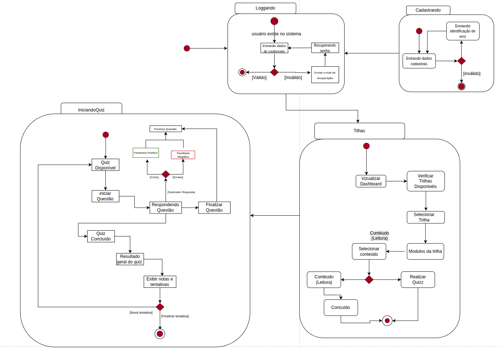
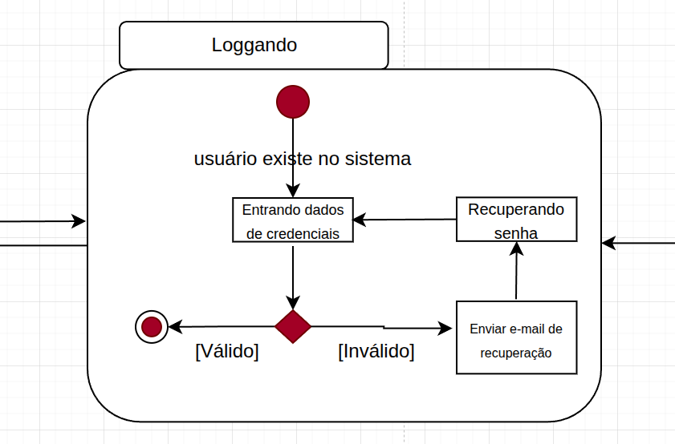
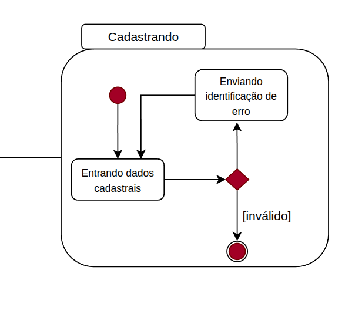
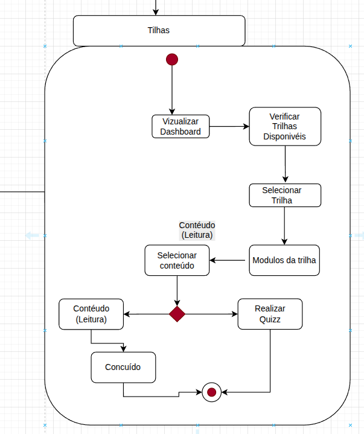
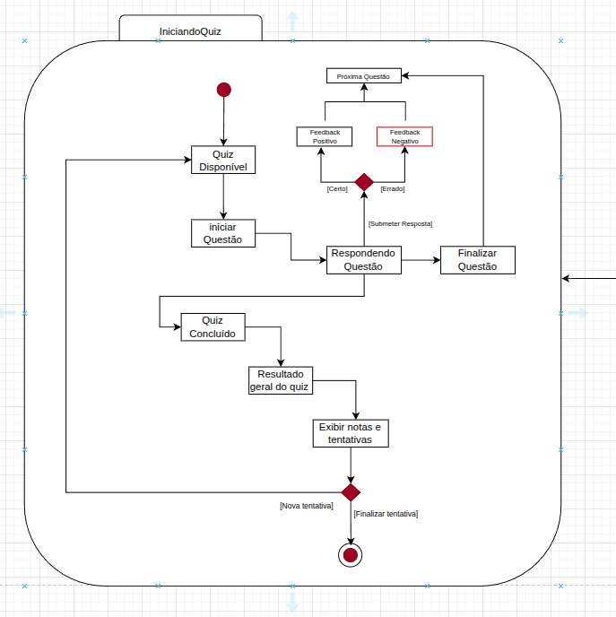

# **_Diagrama de Estados_**

## Participantes

| Matrícula | Aluno              |
| --------- | ------------------ |
| 231026699 | Eduarda Rodrigues  |
| 231035455 | Leticia Jesus      |
| 231012316 | Yasmin Nascimento  |

## **Introdução**

&emsp;&emsp;O diagrama de estados é uma ferramenta fundamental para a modelagem do comportamento dinâmico de sistemas. Ele permite especificar as sequências de estados pelos quais um objeto passa ao longo de sua existência, em resposta a eventos, além de descrever as reações do objeto a esses estímulos. Um estado representa uma condição ou situação na vida do objeto, na qual ele atende a certos critérios, executa atividades ou aguarda a ocorrência de eventos. Eventos são ocorrências relevantes que podem provocar transições entre estados. Por sua vez, as transições definem relações entre estados, indicando mudanças específicas que ocorrem quando determinado evento acontece e determinadas condições são satisfeitas. Representados graficamente, os diagramas de estados são essenciais para compreender e documentar o comportamento dos objetos no contexto de um sistema.<a href="">[1]</a> .

## **Objetivo**

&emsp;&emsp;Este documento tem como objetivo complementar a descrição das classes, documentando os possíveis estados que os objetos de determinada classe podem assumir, bem como os eventos do sistema responsáveis por provocar essas mudanças. Busca-se especificar a dinâmica do sistema por meio de diagramas de estados, reunindo o comportamento completo de uma classe em todos os casos de uso nos quais ela se faz relevante. Dessa forma, o diagrama de estados oferece uma visão abrangente do comportamento dos objetos de uma classe, permitindo antever todas as suas possíveis reações de acordo com os eventos que venham a sofrer. Além disso, o documento visa esclarecer quando e como utilizar diagramas de estados, destacando suas notações e a importância de analisar as transições entre estados para capturar o ciclo de vida de objetos, subsistemas e sistemas como um todo.

## **Metodologia**

A construção do diagrama de estados foi realizada com base nas diretrizes da UML, conforme descrito por Abdala <a href="">[2]</a> , que define esse tipo de diagrama como um modelo voltado à representação dos estados de um objeto ao longo de seu ciclo de vida, bem como dos eventos responsáveis pelas transições entre esses estados.

Foram identificados os principais estados que a instância dessa classe pode assumir durante sua utilização, considerando o fluxo de execução do sistema. Entre os estados definidos, destacam-se: “Não Iniciada”, “Em Andamento”, “Aguardando Finalização” e “Finalizada”, representando as diferentes etapas do ciclo de vida de uma tentativa de realização de um quiz.

Posteriormente, foram mapeados os eventos responsáveis pelas transições entre os estados, tais como iniciar o quiz, responder questões e finalizar a tentativa. Esses eventos correspondem às interações externas realizadas pelo usuário ou a condições internas do sistema, conforme proposto pela UML.

Além disso, foram considerados os elementos fundamentais do diagrama de estados, incluindo o estado inicial, que marca o início da utilização do objeto, e o estado final, que representa o término do seu ciclo de vida. Também foram analisadas possíveis condições de transição, garantindo que os estados definidos sejam alcançáveis e que exista um fluxo consistente até o estado final.

Por fim, o diagrama foi validado com base em critérios de consistência, verificando se todos os estados podem ser atingidos, se há caminhos possíveis até o estado final e se os eventos definidos provocam transições coerentes com o comportamento esperado do sistema. Esse processo contribuiu para a construção de um modelo consistente, alinhado com a lógica de funcionamento da aplicação.

## **Diagramas de Estado**

&emsp;&emsp;Para um melhor acompanhamento na leitura dos diagramas de estado foi disponibilizado uma legenda que pode ser observada na <b>Figura 1</b> e explicada na <b>Tabela 1</b>.

### **Legenda**

### Figura 1: legenda do diagrama de estados.

Fonte: [Eduarda Rodrigues](https://github.com/eduardar0)

## Diagrama 

### Figura 2: Diagrama Geral.

Fonte: Autores, 2026

A Figura 2 demonstra de forma geral o resultado final do diagrama de estados. Os estados compostos posteriores é uma vizualização mais focada.

## Estado composto logando

### Figura 3: Logando.

Fonte: Autores, 2026

Na Figura 3, que representa o estado composto "Logando", inicia-se com o subestado "entrando dados de credenciais". Esse estado corresponde ao momento em que o usuário preenche os campos de login. A mudança de estado ocorre logo em seguida com a presença de um símbolo de Escolha (conforme observado na Figura 1 e explicado na Tabela 1). Nesse ponto, há duas possibilidades: 

1. **Válido** – quando os dados do usuário são compatíveis com os registrados no banco de dados. Essa é a primeira saída dos subestados, levando o fluxo para fora do estado composto "Logando", direcionando o sistema para os estados correspondentes ao usuário já logado.
2. **Inválido** – quando os dados do usuário **não** são compatíveis. Nesse caso, o caminho segue para o subestado "entrando dados de recuperação", onde o usuário insere informações para recuperar a senha. Em seguida, ocorre a transição para "enviando instruções de recuperação", etapa em que o sistema envia por e-mail as instruções de redefinição de senha. O próximo subestado é "recuperando senha", no qual o usuário segue as orientações recebidas. Ao concluir essa etapa, o fluxo retorna ao subestado inicial "entrando dados de credenciais", permitindo nova tentativa de acesso.

Por fim, a outra saída da Escolha ocorre quando o estado composto "Logando" é deixado pela transição [Válido], movendo-se para outros estados compostos que representam o sistema com o usuário já autenticado. O símbolo de Escolha é utilizado exatamente para representar essa bifurcação entre permanecer no processo de recuperação ou prosseguir para a área logada.

## Estado composto Cadastrando

### Figura 4: Cadastrando.

Fonte: Autores, 2026

Na Figura 4, que representa o estado composto "Cadastrando", inicia-se com o subestado "entrando dados cadastrais". Esse estado corresponde ao momento em que o usuário preenche os campos do formulário de cadastro. A mudança de estado ocorre logo em seguida com a presença de um símbolo de Escolha (conforme observado na Figura 1 e explicado na Tabela 1). Nesse ponto, há duas possibilidades:

1. **Válido** – quando os dados cadastrais preenchidos pelo usuário estão corretos e atendem aos critérios exigidos pelo sistema. Essa saída leva o fluxo para fora do estado composto "Cadastrando", direcionando o sistema para o próximo estado (geralmente relacionado à confirmação de cadastro ou acesso ao sistema).

2. **Inválido** – quando os dados cadastrais inseridos pelo usuário apresentam erro (formato incorreto, campos obrigatórios não preenchidos, dados já existentes no sistema, etc.). Nesse caso, o caminho segue para o subestado "enviando identificação de erro", onde o sistema notifica o usuário sobre quais campos ou informações precisam ser corrigidos. Em seguida, após a identificação do erro, o fluxo retorna ao subestado "entrando dados cadastrais", permitindo que o usuário corrija as informações e tente novamente o cadastro.

Por fim, a outra saída da Escolha ocorre quando o estado composto "Cadastrando" é deixado pela transição [Válido], movendo-se para outros estados compostos que representam o sistema com o usuário já registrado. O símbolo de Escolha é utilizado exatamente para representar essa bifurcação entre permanecer no processo de correção de erros ou prosseguir para a conclusão do cadastro.

## Estado composto Trilhas

### Figura 5: Trilhas.

Fonte: Autores, 2026

Na Figura 5, que representa o estado composto "Trilhas", inicia-se com o subestado "visualizar dashboard". Esse estado corresponde ao momento em que o usuário acessa a tela principal do sistema e visualiza suas informações. A mudança de estado ocorre logo em seguida para o subestado "verificar trilhas disponíveis", onde o sistema consulta e exibe quais trilhas de aprendizado estão disponíveis para o usuário. Em seguida, o fluxo segue para o subestado "selecionar trilha", no qual o usuário escolhe qual trilha deseja percorrer.

Após a seleção da trilha, ocorre a transição para o subestado "módulos da trilha", que representa a exibição de todos os módulos que compõem a trilha escolhida. Nesse ponto, há uma ramificação: o usuário pode "selecionar conteúdo" dentro de um módulo, navegando para os materiais de estudo. Em seguida, o fluxo avança para o subestado "conteúdo (leitura)", onde o usuário consome o material educacional (textos, vídeos, etc.). Ao concluir a leitura, o sistema direciona para o subestado "realizar quiz", que corresponde à aplicação de um questionário para validar o aprendizado daquele conteúdo.

O fluxo pode então retornar a etapas anteriores, permitindo ao usuário selecionar novos conteúdos dentro do mesmo módulo, avançar para outros módulos da mesma trilha, ou até mesmo retornar ao início para "verificar trilhas disponíveis" e escolher uma nova trilha. O símbolo de Escolha (conforme observado na Figura 1 e explicado na Tabela 1) pode ser utilizado nesse diagrama para representar as decisões do usuário entre diferentes conteúdos disponíveis, bem como entre diferentes respostas no quiz (válido/inválido).

Por fim, a outra saída ocorre quando o usuário conclui todas as etapas da trilha, momento em que o estado composto "Trilhas" pode ser deixado, movendo-se para outros estados compostos do sistema (como premiações, certificados ou dashboard principal). O símbolo de Escolha é utilizado exatamente para representar essas bifurcações entre as ações disponíveis ao usuário dentro do fluxo de aprendizado.

IniciandoQuizz

## Estado composto Iniciando Quizz

### Figura 6: Iniciando Quizz

Fonte: Autores, 2026

Na Figura 6, que representa o estado composto "Quiz", inicia-se com o subestado "quiz disponível". Esse estado corresponde ao momento em que o sistema verifica se há um quiz liberado para o usuário. Em seguida, ocorre a transição para o subestado "iniciar questão", que dispara o início da primeira pergunta do quiz. O fluxo então avança para o subestado "respondendo questão", onde o usuário está lendo e respondendo à pergunta atual.

Ao finalizar a resposta, ocorre a transição para o símbolo de Escolha (conforme observado na Figura 1 e explicado na Tabela 1), representado pelo ponto de decisão [Submeter Resposta]. Nesse ponto, há duas possibilidades avaliadas pelo sistema:

1. **[Certo]** – quando a resposta submetida pelo usuário está correta. Essa saída direciona o fluxo para o subestado "feedback positivo", onde o sistema exibe uma mensagem de acerto, podendo incluir explicações ou incentivos. Em seguida, o fluxo segue para "próxima questão", avançando para a pergunta seguinte do quiz.

2. **[Errado]** – quando a resposta submetida está incorreta. Essa saída direciona o fluxo para o subestado "feedback negativo", onde o sistema exibe uma mensagem informando o erro, geralmente acompanhada da resposta correta ou de orientações de estudo. Em seguida, o fluxo também segue para "próxima questão", permitindo que o usuário continue o quiz.

Após cada questão, o fluxo passa por "finalizar questão", que registra o resultado daquela pergunta. O sistema então verifica se há mais perguntas: se sim, retorna ao subestado "iniciar questão" para a próxima pergunta; se não, avança para "resultado geral do quiz", onde são consolidados todos os acertos e erros.

Em seguida, o fluxo segue para o subestado "exibir notas e tentativas", que apresenta ao usuário sua pontuação final, estatísticas e histórico de tentativas anteriores. Nesse ponto, há um novo símbolo de Escolha, com duas saídas:

- **[Nova tentativa]** – o usuário opta por refazer o mesmo quiz. O fluxo então retorna ao subestado "quiz disponível", reiniciando todo o processo.
- **[Finalizar tentativa]** – o usuário decide encerrar o quiz. O fluxo então sai do estado composto "Quiz" para "quiz concluído", movendo-se para outros estados compostos do sistema (como dashboard, certificados ou próximos conteúdos).

Por fim, o símbolo de Escolha é utilizado nesse diagrama tanto para representar a bifurcação entre respostas certas e erradas, quanto para representar a decisão do usuário entre nova tentativa ou finalização do quiz, garantindo a navegação flexível dentro do fluxo de avaliação.

## Conclusão

O diagrama de estados desenvolvido permite compreender de forma clara o comportamento dinâmico do sistema, evidenciando as mudanças de estado de uma tentativa de realização de quiz ao longo da interação do usuário com a aplicação. A modelagem do ciclo de vida da classe *TentativaQuiz* possibilitou identificar estados relevantes, como “Não Iniciada”, “Em Andamento”, “Aguardando Finalização” e “Finalizada”, bem como as transições associadas a eventos específicos, como início, progresso e conclusão do quiz.

Essa representação contribui para uma melhor visualização da lógica de funcionamento do sistema, auxiliando na identificação de regras de negócio, validações e fluxos de execução. Além disso, o diagrama favorece a consistência entre os componentes modelados anteriormente, especialmente o diagrama de classes, garantindo alinhamento entre a estrutura estática e o comportamento dinâmico da aplicação.

Por fim, a utilização do diagrama de estados fortalece o processo de desenvolvimento ao proporcionar maior clareza na definição dos fluxos de interação, facilitar a comunicação entre os membros da equipe e servir como apoio para a implementação das funcionalidades relacionadas ao acompanhamento e controle das atividades do usuário na plataforma.

## **Bibliografia**

> <a href="">[1]</a> BOOCH, G. et al. *The Unified Modeling Language User Guide*. In: MEDEIROS, E. *Desenvolvendo Software com UML 2.0: Definitivo*. Makron Books, 2006.

> <a href="https://www.facom.ufu.br/~abdala/DAS5312/Diagrama%20de%20Estados.pdf">[2]</a> ABDALA, Daniel Duarte. *Diagrama de Estados*. Universidade Federal de Uberlândia (UFU). Disponível em: https://www.facom.ufu.br/~abdala/DAS5312/Diagrama%20de%20Estados.pdf. Acesso em: 23 abr. 2026.

| Versão | Data       | Descrição                                                                         | Autor(es)                                          | Revisor(es)                                          |
| ------ | ---------- | --------------------------------------------------------------------------------- | -------------------------------------------------- | ---------------------------------------------------- |
| 1.0    | 23/04/2026 | Criação do arquivo, introdução e objetivo.                                        | [Eduarda Rodrigues](https://github.com/eduardar0) | —                                                    |
| 1.1    | 23/04/2026 | Criação do diagrama e documento.                                                  | [Eduarda Rodrigues](https://github.com/eduardar0),  [Yasmim Moreira](https://github.com/Yasm1nNasc1mento) | [Leticia Maria](https://github.com/leticialopes20) | 