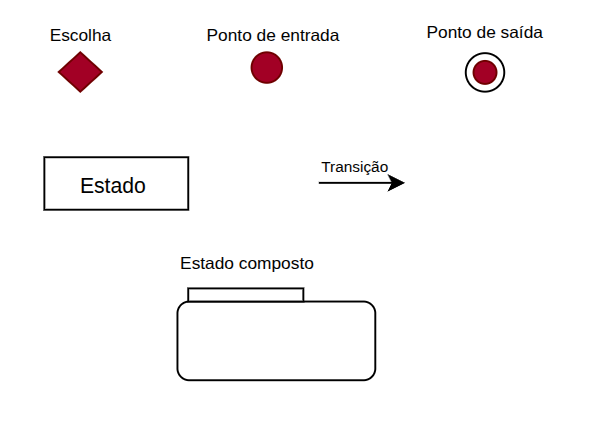

# **_Diagrama de Estados_**

## Participantes

| Matrícula | Aluno              |
| --------- | ------------------ |
| 222006650	| Davi Sousa         |
| 231026699 | Eduarda Rodrigues  |
| 231012316 | Yasmin Nascimento  |

## **Introdução**

&emsp;&emsp;O diagrama de estados é uma ferramenta fundamental para a modelagem do comportamento dinâmico de sistemas. Ele permite especificar as sequências de estados pelos quais um objeto passa ao longo de sua existência, em resposta a eventos, além de descrever as reações do objeto a esses estímulos. Um estado representa uma condição ou situação na vida do objeto, na qual ele atende a certos critérios, executa atividades ou aguarda a ocorrência de eventos. Eventos são ocorrências relevantes que podem provocar transições entre estados. Por sua vez, as transições definem relações entre estados, indicando mudanças específicas que ocorrem quando determinado evento acontece e determinadas condições são satisfeitas. Representados graficamente, os diagramas de estados são essenciais para compreender e documentar o comportamento dos objetos no contexto de um sistema.<a href="">[1]</a> .

## **Objetivo**

&emsp;&emsp;Este documento tem como objetivo complementar a descrição das classes, documentando os possíveis estados que os objetos de determinada classe podem assumir, bem como os eventos do sistema responsáveis por provocar essas mudanças. Busca-se especificar a dinâmica do sistema por meio de diagramas de estados, reunindo o comportamento completo de uma classe em todos os casos de uso nos quais ela se faz relevante. Dessa forma, o diagrama de estados oferece uma visão abrangente do comportamento dos objetos de uma classe, permitindo antever todas as suas possíveis reações de acordo com os eventos que venham a sofrer. Além disso, o documento visa esclarecer quando e como utilizar diagramas de estados, destacando suas notações e a importância de analisar as transições entre estados para capturar o ciclo de vida de objetos, subsistemas e sistemas como um todo.

## **Metodologia**

## **Diagramas de Estado**

&emsp;&emsp;Para um melhor acompanhamento na leitura dos diagramas de estado foi disponibilizado uma legenda que pode ser observada na <b>Figura 1</b> e explicada na <b>Tabela 1</b>.

### **Legenda**

<h6 align="center">Figura 1: legenda do diagrama de estados.</h6>

  
   
  Fonte: <a href="https://github.com/eduardar0">Eduarda Rodrigues</a>

## **Bibliografia**

> <a href="">[1]</a> BOOCH, G. et al. The Unified Modeling Language User Guide Medeiros, E. Desenvolvendo Software com UML 2.0: Definitivo, Makron Books, 2006.

| Versão | Data       | Descrição                                                                                                      | Autor(es)                                          | Revisor(es)                                          |
| ------ | ---------- | -------------------------------------------------------------------------------------------------------------- | -------------------------------------------------- | ---------------------------------------------------- |
| 1.0    | 23/04/2026 | Criação do arquivo, introdução e objetivo.                                                            | [Eduarda Rodrigues](https://github.com/eduardar0) |     |