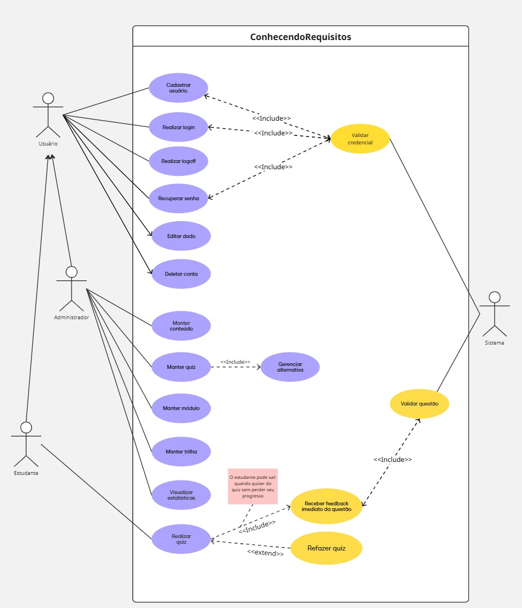

## 2.3.1 Diagrama de Casos de Uso

## Participantes

Os participantes da elaboração do diagrama de casos de uso estão descritos na tabela a seguir:

Tabela 1: Participantes da elaboração do Diagrama de Caso de Uso

| Matrícula | Aluno              |
| --------- | ------------------ |
| 231027032 | Arthur Oliveira    |
| 231037665 | Daniel Nascimento  |
| 231026699 | Eduarda Rodrigues  |
| 231037692 | Isabella Choukaira |
| 231035455 | Leticia Jesus      |
| 231038303 | Yan Aguiar         |
| 231012316 | Yasmin Nascimento  |

---

# Introdução

O Diagrama de Casos de Uso é um dos principais artefatos da UML (Unified Modeling Language), pertencente à categoria de diagramas comportamentais. Sua finalidade é representar, de forma visual e objetiva, as interações entre os atores externos e o sistema, demonstrando os serviços oferecidos pela aplicação e os objetivos que cada usuário deseja alcançar por meio dela.

Segundo Cockburn (2001), casos de uso descrevem sequências de interações entre usuários e sistemas capazes de gerar valor para os envolvidos. Dessa forma, esse tipo de modelagem auxilia diretamente no levantamento e validação de requisitos funcionais, além de facilitar a comunicação entre equipe técnica, clientes e demais stakeholders do projeto.

No contexto do sistema **ConhecendoRequisitos**, o Diagrama de Casos de Uso possui papel essencial por representar uma plataforma educacional gamificada voltada ao ensino de Engenharia de Requisitos. O sistema contempla perfis distintos de usuários, como estudantes e administradores, cada um com permissões específicas e diferentes objetivos dentro da plataforma.

# Metodologia

Para a construção do Diagrama de Casos de Uso do sistema **ConhecendoRequisitos**, foi adotada uma metodologia estruturada baseada nas melhores práticas de Engenharia de Requisitos e modelagem orientada a objetos.

### Etapa 1 – Definição do Escopo

Inicialmente foram definidos os objetivos centrais da plataforma, delimitando suas fronteiras funcionais. O foco principal estabelecido foi a oferta de um ambiente educacional digital para aprendizagem de Engenharia de Requisitos por meio de quizzes e trilhas.

Esta fase seguiu os princípios de definição de contexto propostos por Wiegers e Beatty (2013), garantindo que todos os membros da equipe tivessem uma compreensão uniforme dos limites do sistema e de suas responsabilidades funcionais.

### Etapa 2 – Identificação dos Atores

A equipe aplicou a técnica de análise de stakeholders descrita por Pressman (2016) para classificar os diferentes tipos de usuários e sistemas externos que interagem com a plataforma, definindo suas características, necessidades e níveis de autorização no sistema.
A partir da análise do contexto, foram identificados os seguintes atores:

- **Usuário**: ator genérico autenticado
- **Estudante**: herda de Usuário; realiza quizzes e acompanha seu progresso.
- **Administrador**: herda de Usuário; gerencia conteúdos.
- **Sistema**: serviços internos de validação.

### Etapa 3 - Modelagem Colaborativa e Refinamento:

A construção do diagrama foi realizada de forma colaborativa utilizando a plataforma Miro, com cada um dos integrantes presentes contribuindo gradualmente em diferentes partes do modelo. A abordagem incremental permitiu revisões contínuas e refinamentos baseados no feedback da equipe, seguindo os princípios de desenvolvimento iterativo recomendados por Larman (2007). Durante esta fase, foram estabelecidos os relacionamentos entre casos de uso (include, extend) e as associações com os atores identificados.

> Foram identificadas as principais funcionalidades:

- Cadastro
- Login / Logout
- Recuperação de senha
- Edição e exclusão de conta
- Manutenção de conteúdo
- Gerenciamento de quizzes
- Manutenção de Trilhas e módulos
- Visualização de estatísticas
- Realização de quizzes
- Feedback automático da questão realizada
- Refazer quiz
- Validações internas

> O diagrama foi estruturado considerando:

- Associações entre atores e funcionalidades
- Relações `<<include>>`
- Relações `<<extend>>`
- Generalização entre atores

### Etapa 4 – Validação

Após elaboração, o modelo foi revisado visando:

- Coerência funcional
- Clareza visual
- Consistência UML
- Cobertura de requisitos principais

---

# Diagrama

Abaixo se encontra o Diagrama de Casos de Uso do sistema ConhecendoRequisitos

### **Figura 1 – Diagrama de Casos de Uso**

---

# Tabelas de Casos de Uso:

## Caso de Uso 01

### Tabela 2: Cadastrar Usuário

| UC01                           | Descrição                                                                                                                                                                                                                                    |
| ------------------------------ | -------------------------------------------------------------------------------------------------------------------------------------------------------------------------------------------------------------------------------------------- |
| **Nome do Caso de Uso**        | Cadastrar Usuário                                                                                                                                                                                                                            |
| **Ator Principal**             | Usuário                                                                                                                                                                                                                                      |
| **Atores Secundários**         | Sistema                                                                                                                                                                                                                                      |
| **Objetivo**                   | Permitir que novos usuários realizem cadastro na plataforma.                                                                                                                                                                                 |
| **Pré-condições**              | O usuário não deve possuir conta cadastrada.                                                                                                                                                                                                 |
| **Fluxo Principal de Eventos** | 1. O usuário acessa a plataforma. 2. Seleciona a opção de cadastro. 3. O sistema apresenta formulário. 4. O usuário preenche os dados solicitados. 5. O sistema valida as informações. 6. O cadastro é concluído com sucesso. |
| **Fluxos Alternativos**        | O usuário cancela o cadastro antes da conclusão.                                                                                                                                                                                             |
| **Exceções**                   | Dados inválidos ou usuário já cadastrado.                                                                                                                                                                                                    |
| **Ponto(s) de Extensão**       | Include: Validar credencial                                                                                                                                                                                                                  |
| **Pós-condições**              | Conta criada com sucesso.                                                                                                                                                                                                                    |

---

## Caso de Uso 02

### Tabela 3: Realizar Login

| UC02                           | Descrição                                                                                                                                         |
| ------------------------------ | ------------------------------------------------------------------------------------------------------------------------------------------------- |
| **Nome do Caso de Uso**        | Realizar Login                                                                                                                                    |
| **Ator Principal**             | Usuário                                                                                                                                           |
| **Atores Secundários**         | Sistema                                                                                                                                           |
| **Objetivo**                   | Permitir autenticação do usuário no sistema.                                                                                                      |
| **Pré-condições**              | Usuário cadastrado.                                                                                                                               |
| **Fluxo Principal de Eventos** | 1. O usuário acessa a tela de login. 2. Informa usuário e senha. 3. O sistema valida credenciais. 4. O sistema inicia sessão do usuário. |
| **Exceções**                   | Credenciais inválidas.                                                                                                                            |
| **Ponto(s) de Extensão**       | Include: Validar credencial                                                                                                                       |
| **Pós-condições**              | Sessão autenticada iniciada.                                                                                                                      |

---

## Caso de Uso 03

### Tabela 4: Realizar Logoff

| UC03                           | Descrição                                                                                                                   |
| ------------------------------ | --------------------------------------------------------------------------------------------------------------------------- |
| **Nome do Caso de Uso**        | Realizar Logoff                                                                                                             |
| **Ator Principal**             | Usuário                                                                                                                     |
| **Objetivo**                   | Encerrar sessão ativa do usuário.                                                                                           |
| **Pré-condições**              | Usuário autenticado.                                                                                                        |
| **Fluxo Principal de Eventos** | 1. O usuário seleciona a opção sair. 2. O sistema encerra a sessão atual. 3. Sistema redireciona para página inicial. |
| **Exceções**                   | Falha ao encerrar sessão.                                                                                                   |
| **Pós-condições**              | Usuário desconectado do sistema.                                                                                            |

---

## Caso de Uso 04

### Tabela 5: Recuperar Senha

| UC04                           | Descrição                                                                                                                                          |
| ------------------------------ | -------------------------------------------------------------------------------------------------------------------------------------------------- |
| **Nome do Caso de Uso**        | Recuperar Senha                                                                                                                                    |
| **Ator Principal**             | Usuário                                                                                                                                            |
| **Atores Secundários**         | Sistema                                                                                                                                            |
| **Objetivo**                   | Permitir redefinição de senha esquecida.                                                                                                           |
| **Pré-condições**              | Conta previamente cadastrada.                                                                                                                      |
| **Fluxo Principal de Eventos** | 1. O usuário seleciona recuperar senha. 2. Informa e-mail cadastrado. 3. O sistema valida os dados. 4. Envia instruções para redefinição. |
| **Exceções**                   | E-mail inexistente no sistema.                                                                                                                     |
| **Ponto(s) de Extensão**       | Include: Validar credencial                                                                                                                        |
| **Pós-condições**              | Nova senha cadastrada.                                                                                                                             |

---

## Caso de Uso 05

### Tabela 6: Editar Dado

| UC05                           | Descrição                                                                                                           |
| ------------------------------ | ------------------------------------------------------------------------------------------------------------------- |
| **Nome do Caso de Uso**        | Editar Dado                                                                                                         |
| **Ator Principal**             | Usuário                                                                                                             |
| **Objetivo**                   | Permitir alteração de dados cadastrais.                                                                             |
| **Pré-condições**              | Usuário autenticado.                                                                                                |
| **Fluxo Principal de Eventos** | 1. Usuário acessa perfil. 2. Seleciona editar dados. 3. Atualiza informações. 4. Sistema salva alterações. |
| **Exceções**                   | Dados inválidos. Falha ao salvar os dados.                                                                       |
| **Pós-condições**              | Dados atualizados.                                                                                                  |

---

## Caso de Uso 06

### Tabela 7: Deletar Conta

| UC06                           | Descrição                                                                                                   |
| ------------------------------ | ----------------------------------------------------------------------------------------------------------- |
| **Nome do Caso de Uso**        | Deletar Conta                                                                                               |
| **Ator Principal**             | Usuário                                                                                                     |
| **Objetivo**                   | Excluir conta do sistema.                                                                                   |
| **Pré-condições**              | Usuário autenticado.                                                                                        |
| **Fluxo Principal de Eventos** | 1. Usuário solicita exclusão. 2. Sistema pede confirmação. 3. Usuário confirma. 4. Conta removida. |
| **Fluxos Alternativos**        | 4. Usuário cancela solicitação de exclusão.                                                                 |
| **Exceções**                   | Falha de remoção no banco de dados.                                                                         |
| **Pós-condições**              | Conta excluída permanentemente.                                                                             |

---

## Caso de Uso 07

### Tabela 8: Manter Conteúdo

| UC07                           | Descrição                                                                                                    |
| ------------------------------ | ------------------------------------------------------------------------------------------------------------ |
| **Nome do Caso de Uso**        | Manter Conteúdo                                                                                              |
| **Ator Principal**             | Administrador                                                                                                |
| **Objetivo**                   | Gerenciar conteúdos disponibilizados na plataforma.                                                          |
| **Pré-condições**              | Administrador autenticado.                                                                                   |
| **Fluxo Principal de Eventos** | 1. Admin acessa painel. 2. Escolhe conteúdo. 3. Cria, edita ou remove. 4. Sistema salva alterações. |
| **Pós-condições**              | Conteúdo atualizado.                                                                                         |

---

## Caso de Uso 08

### Tabela 9: Manter Quiz

| UC08                           | Descrição                                                                                                            |
| ------------------------------ | -------------------------------------------------------------------------------------------------------------------- |
| **Nome do Caso de Uso**        | Manter Quiz                                                                                                          |
| **Ator Principal**             | Administrador                                                                                                        |
| **Objetivo**                   | Criar, editar e remover quizzes.                                                                                     |
| **Pré-condições**              | Administrador autenticado.                                                                                           |
| **Fluxo Principal de Eventos** | 1. Administrador acessa módulo de quizzes. 2. Cria ou altera quiz. 3. Define questões. 4. Salva alterações. |
| **Exceções**                   | Questão incompleta. Quiz sem perguntas.                                                                           |
| **Ponto(s) de Extensão**       | Include: Gerenciar alternativa                                                                                       |
| **Pós-condições**              | Quiz disponível para estudantes.                                                                                     |

---

## Caso de Uso 09

### Tabela 10: Gerenciar Alternativa

| UC09                           | Descrição                                                       |
| ------------------------------ | --------------------------------------------------------------- |
| **Nome do Caso de Uso**        | Gerenciar Alternativa                                           |
| **Ator Principal**             | Administrador                                                   |
| **Objetivo**                   | Criar, editar ou excluir alternativas de questões.              |
| **Pré-condições**              | Estar editando ou criando questões.                             |
| **Fluxo Principal de Eventos** | Inserir alternativas. Definir correta. Salvar alterações. |
| **Exceções**                   | Nenhuma alternativa correta definida.                           |
| **Pós-condições**              | Alternativas atualizadas.                                       |

---

## Caso de Uso 10

### Tabela 11: Manter Módulo

| UC10                    | Descrição                                         |
| ----------------------- | ------------------------------------------------- |
| **Nome do Caso de Uso** | Manter Módulo                                     |
| **Ator Principal**      | Administrador                                     |
| **Objetivo**            | Gerenciar módulos de aprendizagem.                |
| **Fluxo Principal**     | Criar, editar ou remover módulos.                 |
| **Pós-condições**       | Estrutura modular criada, atualizada ou excluida. |

---

## Caso de Uso 11

### Tabela 12: Manter Trilha

| UC11                    | Descrição                                                         |
| ----------------------- | ----------------------------------------------------------------- |
| **Nome do Caso de Uso** | Manter Trilha                                                     |
| **Ator Principal**      | Administrador                                                     |
| **Objetivo**            | Gerenciar trilhas educacionais.                                   |
| **Fluxo Principal**     | Criar, editar ou remover trilhas. Associar módulos. Salvar. |
| **Pós-condições**       | Trilha criada, atualizada ou excluida.                            |

---

## Caso de Uso 12

### Tabela 13: Visualizar Estatísticas

| UC12                    | Descrição                                                      |
| ----------------------- | -------------------------------------------------------------- |
| **Nome do Caso de Uso** | Visualizar Estatísticas                                        |
| **Ator Principal**      | Administrador                                                  |
| **Objetivo**            | Consultar métricas e desempenho dos estudantes.                |
| **Fluxo Principal**     | Acessa dashboard. Seleciona filtros. Visualiza métricas. |
| **Fluxos Alternativos** | Exportar relatório.                                            |
| **Pós-condições**       | Dados são analisados.                                          |

---

## Caso de Uso 13

### Tabela 14: Realizar Quiz

| UC13                           | Descrição                                                                                                                                                       |
| ------------------------------ | --------------------------------------------------------------------------------------------------------------------------------------------------------------- |
| **Nome do Caso de Uso**        | Realizar Quiz                                                                                                                                                   |
| **Ator Principal**             | Estudante                                                                                                                                                       |
| **Objetivo**                   | Permitir resolução de quizzes disponíveis.                                                                                                                      |
| **Pré-condições**              | Estudante autenticado.                                                                                                                                          |
| **Fluxo Principal de Eventos** | 1. Estudante escolhe quiz. 2. Responde questões. 3. Sistema corrige respostas. 4. Sistema mostra feedback. 5. Próxima questão. 6. Finaliza quiz. |
| **Ponto(s) de Extensão**       | Include: Receber feedback imediato da questão. Extend: Refazer quiz                                                                                          |
| **Pós-condições**              | Resultado registrado.                                                                                                                                           |

---

## Caso de Uso 14

### Tabela 15: Receber Feedback Imediato da Questão

| UC14                     | Descrição                                                       |
| ------------------------ | --------------------------------------------------------------- |
| **Nome do Caso de Uso**  | Receber Feedback Imediato da Questão                            |
| **Ator Principal**       | Estudante                                                       |
| **Objetivo**             | Informar imediatamente se a resposta está correta ou incorreta. |
| **Fluxo Principal**      | Sistema corrige resposta. Mostra mensagem imediata.          |
| **Relacionamento**       | Include de realizar quiz                                        |
| **Ponto(s) de Extensão** | Include: Validar questão                                        |
| **Pós-condições**        | estudante recebe o feedback imediatamente da questão.           |

---

## Caso de Uso 15

### Tabela 16: Validar Questão

| UC15                    | Descrição                                              |
| ----------------------- | ------------------------------------------------------ |
| **Nome do Caso de Uso** | Validar Questão                                        |
| **Ator Principal**      | Sistema                                                |
| **Objetivo**            | Comparar resposta enviada com gabarito correto.        |
| **Fluxo Principal**     | Comparar resposta com gabarito. Retornar resultado. |
| **Relacionamento**      | Include de receber feedback imediato da questão.       |

---

## Caso de Uso 16

### Tabela 17: Refazer Quiz

| UC16                    | Descrição                                            |
| ----------------------- | ---------------------------------------------------- |
| **Nome do Caso de Uso** | Refazer Quiz                                         |
| **Ator Principal**      | Estudante                                            |
| **Objetivo**            | Permitir nova tentativa no quiz realizado.           |
| **Pré-condições**       | Quiz já finalizado.                                  |
| **Fluxo Principal**     | Estudante escolhe refazer. Sistema reinicia quiz. |
| **Relacionamento**      | Extend de Realizar Quiz                              |
| **Pós-condições**       | Nova tentativa iniciada.                             |

---

## Caso de Uso 17

### Tabela 18: Validar Credencial

| UC17                    | Descrição                                                |
| ----------------------- | -------------------------------------------------------- |
| **Nome do Caso de Uso** | Validar Credencial                                       |
| **Ator Principal**      | Sistema                                                  |
| **Objetivo**            | Verificar dados de autenticação fornecidos pelo usuário. |
| **Fluxo Principal**     | Sistema compara dados informados com registros internos. |
| **Usado por**           | Cadastro, Login e Recuperar Senha                        |
| **Pós-condições**       | Credenciais aprovadas ou negadas.                        |

---

# Senso Crítico:

Como o grupo já possuía familiaridade prévia com esse tipo de diagrama, o processo de elaboração ocorreu de maneira mais fluida e eficiente, permitindo maior concentração na clareza, consistência e organização das informações apresentadas. Essa experiência anterior contribuiu para que a equipe direcionasse esforços não apenas à construção técnica do artefato, mas também à qualidade da representação dos requisitos do sistema.

O senso crítico esteve presente no cuidado individual e coletivo durante todo o desenvolvimento do documento, especialmente na análise das funcionalidades, na definição dos atores e na verificação da coerência entre os casos de uso e os objetivos do sistema. Buscou-se produzir um artefato simples, compreensível e fiel às necessidades identificadas, evitando ambiguidades e redundâncias.

Além de seu papel como instrumento de documentação, os casos de uso também se mostraram relevantes como ferramenta de comunicação entre os integrantes da equipe, proporcionando um entendimento comum sobre o comportamento esperado do sistema e facilitando discussões relacionadas ao escopo e às funcionalidades propostas.

Por fim, a atividade contribuiu para o fortalecimento de competências importantes, como organização, comunicação, colaboração e pensamento crítico, habilidades essenciais para o desenvolvimento de software de forma estruturada e com maior qualidade.

# Conclusão:

A modelagem de casos de uso do sistema ConhecendoRequisitos mostrou-se fundamental para identificar e documentar as principais funcionalidades esperadas da plataforma. Por meio dessa técnica, foi possível representar de forma organizada as interações entre usuários e sistema, servindo como base para etapas futuras de análise, projeto e implementação.

## Referências:

> BARROS, J. Casos de Uso e Respectivos Diagramas. [s.l: s.n.]. Disponível em: http://gres.uninova.pt/~jpb/textos/useCaseDiagrams.pdf.

> COCKBURN, Alistair. Writing Effective Use Cases. Boston: Addison-Wesley Professional, 2001.

> FOWLER, Martin. UML Essencial: Um Breve Guia para a Linguagem de Modelagem Padrão. 3. ed. Porto Alegre: Bookman, 2004.

> JACOBSON, Ivar; CHRISTERSON, Magnus; JONSSON, Patrik; ÖVERGAARD, Gunnar. Object-Oriented Software Engineering: A Use Case Driven Approach. Boston: Addison-Wesley Professional, 1992.

> KIRILL FAKHROUTDINOV. Use case diagrams are UML diagrams describing units of useful functionality (use cases) performed by a system in collaboration with external users (actors). Disponível em: https://www.uml-diagrams.org/use-case-diagrams.html.

> LARMAN, Craig. Utilizando UML e Padrões: Uma Introdução à Análise e ao Projeto Orientados a Objetos e ao Desenvolvimento Iterativo. 3ª ed. Porto Alegre: Bookman, 2007.

> PRESSMAN, Roger S. Engenharia de Software: Uma Abordagem Profissional. 8. ed. Porto Alegre: AMGH, 2016.

> SERRANO, Milene, Arquitetura e Desenho de Software - Aula - Modelagem UML Dinâmica. Disponível em: https://aprender3.unb.br/pluginfile.php/3178534/mod_page/content/1/Arquitetura%20e%20Desenho%20de%20Software%20-%20Aula%20Modelagem%20UML%20Din%C3%A2mica%20-%20Profa.%20Milene.pdf. Universidade de Brasília - UnB. Brasília. Acesso em 20 de setembro de 2025.

> WIEGERS, Karl; BEATTY, Joy. Software Requirements. 3. ed. Redmond: Microsoft Press, 2013.

## Histórico de Versões

| Versão | Data  | Descrição                                                          | Autor(es)                                          | Revisor(es)                                        | Detalhes da Revisão           |
| ------ | ----- | ------------------------------------------------------------------ | -------------------------------------------------- | -------------------------------------------------- | ----------------------------- |
| 1.0    | 20/04 | Adiciona Introdução, Metodologia, referências e Diagrama na página | [Letícia Lopes](https://github.com/leticialopes20) | [Arthur Evangelista](https://github.com/arthurevg) | documento criado              |
| 1.1    | 23/04 | Adiciona casos de uso, senso crítico e conclusão na página         | [Letícia Lopes](https://github.com/leticialopes20) | [Arthur Evangelista](https://github.com/arthurevg) | documento revisado e aprovado |
