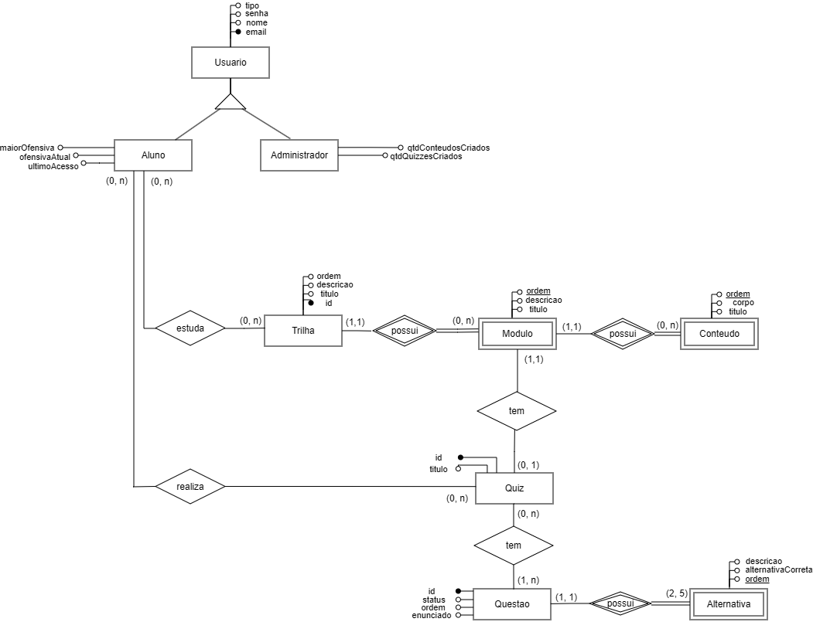

# 2.5.4. Diagrama Entidade-Relacionamento (DER)

## Participantes

Os participantes da elaboração do Diagrama Entidade-Relacionamento estão descritos na tabela a seguir:

**Tabela 1: Participantes da elaboração do DER**

| Matrícula | Aluno             |
| --------- | ----------------- |
| 231027032 | Arthur Oliveira   |
| 231026699 | Eduarda Rodrigues |
| 231035455 | Leticia Jesus     |

_Fonte: Elaborado pelos autores. (2026)_

## 1. Introdução

O Diagrama Entidade-Relacionamento (DER) é uma representação gráfica utilizada para modelar a estrutura lógica de um banco de dados de forma conceitual. Proposto originalmente por Peter Chen (1976), o DER descreve as entidades envolvidas no domínio do sistema, seus atributos e os relacionamentos entre elas, sem se prender a detalhes de implementação específicos de um SGBD.

Este artefato foi elaborado a partir do [Diagrama de Classes](/Modelagem/2.1.2.DiagramaClasses.md) do projeto ConhecendoRequisitos, mapeando as classes, associações e hierarquias de herança para o modelo entidade-relacionamento.

## 2. Metodologia

O mapeamento do diagrama de classes para o DER seguiu as seguintes diretrizes:

- **Herança (Generalização/Especialização):** A hierarquia Usuario → Administrador / Aluno foi representada como uma especialização total e exclusiva (disjunta).
- **Entidades fracas:** As entidades Modulo, Conteudo e Alternativa foram identificadas como entidades fracas, pois dependem existencialmente de suas entidades proprietárias e utilizam `ordem` como chave parcial. A entidade Questao foi mantida como entidade forte, pois pode existir independentemente em um banco de questões.
- **Relacionamentos N:N simplificados:** Os relacionamentos Aluno–Trilha ("estuda") e Aluno–Quiz ("realiza") são representados diretamente como relacionamentos N:N, sendo o detalhamento das entidades de progresso responsabilidade do [Diagrama Lógico](/Modelagem/2.5.5.DiagramaLogico.md).
- **Atributos derivados:** Atributos como `qtdModulos`, `qtdConteudos`, `qtdQuestoes` e `qtdAlternativas` foram omitidos por serem calculáveis a partir dos relacionamentos.
- **Sem chaves estrangeiras:** No modelo conceitual (DER), os relacionamentos são representados por losangos com cardinalidades, sem incluir chaves estrangeiras nos atributos das entidades. As FKs aparecem apenas no [Diagrama Lógico](/Modelagem/2.5.5.DiagramaLogico.md).

## 3. Entidades e Atributos

### 3.1. Usuario (Entidade Forte — Genérica)

| Atributo | Tipo   | Restrição |
| -------- | ------ | --------- |
| email    | String | PK        |
| nome     | String | NOT NULL  |
| senha    | String | NOT NULL  |
| tipo     | String | NOT NULL  |

### 3.2. Administrador (Especialização de Usuario)

| Atributo            | Tipo | Restrição |
| ------------------- | ---- | --------- |
| qtdConteudosCriados | int  |           |
| qtdQuizzesCriados   | int  |           |

> Herda o atributo `email` como identificador, via especialização de Usuario.

### 3.3. Aluno (Especialização de Usuario)

| Atributo      | Tipo | Restrição |
| ------------- | ---- | --------- |
| maiorOfensiva | int  |           |
| ofensivaAtual | int  |           |
| ultimoAcesso  | Date |           |

> Herda o atributo `email` como identificador, via especialização de Usuario.

### 3.4. Trilha (Entidade Forte)

| Atributo  | Tipo   | Restrição |
| --------- | ------ | --------- |
| id        | int    | PK        |
| titulo    | String | NOT NULL  |
| descricao | String |           |
| ordem     | int    |           |

### 3.5. Modulo (Entidade Fraca — proprietária: Trilha)

| Atributo  | Tipo   | Restrição     |
| --------- | ------ | ------------- |
| titulo    | String | NOT NULL      |
| descricao | String |               |
| ordem     | int    | Chave Parcial |

> Identificado pela combinação da chave de **Trilha** + `ordem`.

### 3.6. Conteudo (Entidade Fraca — proprietária: Modulo)

| Atributo | Tipo   | Restrição     |
| -------- | ------ | ------------- |
| titulo   | String | NOT NULL      |
| corpo    | String |               |
| ordem    | int    | Chave Parcial |

> Identificado pela combinação da chave de **Modulo** + `ordem`.

### 3.7. Quiz (Entidade Forte)

| Atributo | Tipo   | Restrição |
| -------- | ------ | --------- |
| id       | int    | PK        |
| titulo   | String | NOT NULL  |

### 3.8. Questao (Entidade Forte)

| Atributo  | Tipo    | Restrição |
| --------- | ------- | --------- |
| id        | int     | PK        |
| enunciado | String  | NOT NULL  |
| status    | boolean |           |
| ordem     | int     |           |

> Entidade forte — pode existir independentemente em um banco de questões, sendo reutilizável em diferentes quizzes.

### 3.9. Alternativa (Entidade Fraca — proprietária: Questao)

| Atributo           | Tipo    | Restrição     |
| ------------------ | ------- | ------------- |
| descricao          | String  | NOT NULL      |
| alternativaCorreta | boolean | NOT NULL      |
| ordem              | int     | Chave Parcial |

> Identificada pela combinação da chave de **Questao** + `ordem`. Uma alternativa não possui identidade própria sem a questão à qual pertence.

## 4. Relacionamentos

A tabela a seguir descreve todos os relacionamentos do modelo:

**Tabela 2: Relacionamentos do DER**

| Relacionamento        | Entidade 1 | Cardinalidade | Entidade 2    | Tipo                  | Descrição                                                                               |
| --------------------- | ---------- | :-----------: | ------------- | --------------------- | --------------------------------------------------------------------------------------- |
| é um (especialização) | Usuario    |  (1,1):(1,1)  | Administrador | Especialização (t,e)  | Especialização total e exclusiva                                                        |
| é um (especialização) | Usuario    |  (1,1):(1,1)  | Aluno         | Especialização (t,e)  | Especialização total e exclusiva                                                        |
| estuda                | Aluno      |  (0,n):(0,n)  | Trilha        | N:N                   | Um aluno estuda zero ou várias trilhas; uma trilha é estudada por zero ou vários alunos |
| realiza               | Aluno      |  (0,n):(0,n)  | Quiz          | N:N                   | Um aluno realiza zero ou vários quizzes; um quiz é realizado por zero ou vários alunos  |
| possui                | Trilha     |  (1,1):(0,n)  | Modulo        | Identificador (fraca) | Uma trilha possui zero ou vários módulos; um módulo pertence a exatamente uma trilha    |
| possui                | Modulo     |  (1,1):(0,n)  | Conteudo      | Identificador (fraca) | Um módulo possui zero ou vários conteúdos; um conteúdo pertence a exatamente um módulo  |
| tem                   | Modulo     |  (1,1):(0,1)  | Quiz          | Regular               | Um módulo pode ter zero ou um quiz; um quiz pertence a exatamente um módulo             |
| tem                   | Quiz       |  (0,n):(1,n)  | Questao       | Regular               | Um quiz tem uma ou várias questões; uma questão pode pertencer a zero ou vários quizzes |
| possui                | Questao    |  (1,1):(2,5)  | Alternativa   | Identificador (fraca) | Uma questão possui de 2 a 5 alternativas                                                |

_Fonte: Elaborado pelos autores. (2026)_

## 5. Notação Visual

No diagrama visual (draw.io), as seguintes convenções de notação são utilizadas:

**Tabela 3: Notação visual utilizada no DER**

| Elemento                     | Representação                                       |
| ---------------------------- | --------------------------------------------------- |
| Entidade forte               | Retângulo com borda simples                         |
| Entidade fraca               | Retângulo com borda dupla                           |
| Relacionamento regular       | Losango com borda simples                           |
| Relacionamento identificador | Losango com borda dupla                             |
| Atributo regular             | Linha com círculo vazio (○) e rótulo                |
| Atributo chave (PK)          | Linha com círculo preenchido (●)                    |
| Atributo chave parcial       | Linha com círculo vazio e rótulo sublinhado         |
| Especialização               | Triângulo entre entidade genérica e especializações |

_Fonte: Elaborado pelos autores. (2026)_

## 6. Diagrama

**Figura 1: Diagrama Entidade-Relacionamento do ConhecendoRequisitos**

_Fonte: Elaborado pelos autores. (2026)_

## 7. Conclusão

O Diagrama Entidade-Relacionamento apresentado neste documento modela de forma conceitual a estrutura de dados da plataforma ConhecendoRequisitos. As entidades fracas (Modulo, Conteudo e Alternativa) refletem a dependência existencial em relação às suas proprietárias, sendo identificadas pela combinação da chave da entidade proprietária com o atributo `ordem` como chave parcial. A entidade Questao foi mantida como entidade forte, considerando que questões podem existir de forma independente em um banco de questões, podendo ser reutilizadas.

Os relacionamentos N:N entre Aluno–Trilha ("estuda") e Aluno–Quiz ("realiza") são representados diretamente no DER, sendo o detalhamento das entidades associativas de progresso (ProgressoTrilha, ProgressoModulo, ProgressoConteudo e TentativaQuiz) responsabilidade do modelo lógico.

Este modelo conceitual serve como base para a elaboração do [Diagrama Lógico](/Modelagem/2.5.5.DiagramaLogico.md) e posterior implementação física do banco de dados.

## Referências Bibliográficas

> CHEN, Peter. **The Entity-Relationship Model: Toward a Unified View of Data**. ACM Transactions on Database Systems, v. 1, n. 1, p. 9–36, 1976. Disponível em: <https://dl.acm.org/doi/10.1145/320434.320440>. Acesso em: 15 abr. 2026.

> SERRANO, Mauricio. **Sistemas de Banco de Dados 1 — Aula de Modelagem de Dados**. Universidade de Brasília – UnB. Disponível em: <https://aprender3.unb.br>. Acesso em: 15 abr. 2026.

> DRAW.IO. **Diagrams.net — Free Online Diagram Software**. Disponível em: <https://www.drawio.com>. Acesso em: 15 abr. 2026.

## Histórico de versões

| Versão | Data  | Descrição                            | Autor                                           | Revisor                                          | Detalhes da Revisão |
| ------ | ----- | ------------------------------------ | ----------------------------------------------- | ------------------------------------------------ | ------------------- |
| 1.0    | 20/04 | Criação do documento e adição do DER | [Arthur Oliveira](https://github.com/arthurevg) | [Yan Matheus](https://github.com/Yanmatheus0812) | Revisado e aprovado |
