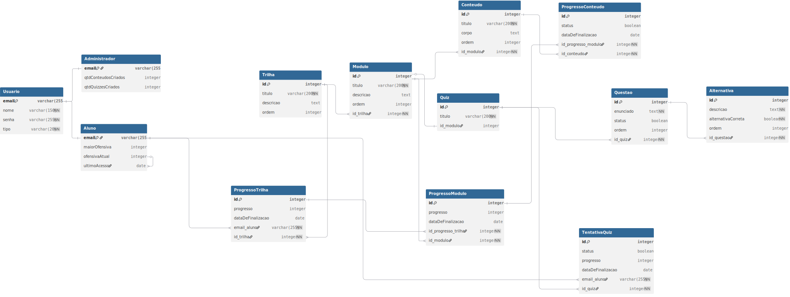

# 2.5.5. Diagrama Lógico de Dados

## Participantes

Os participantes da elaboração do Diagrama Lógico de Dados estão descritos na tabela a seguir:

**Tabela 1: Participantes da elaboração do Diagrama Lógico**

| Matrícula | Aluno           |
| --------- | --------------- |
| 231027032 | Arthur Oliveira |

## 1. Introdução

O Diagrama Lógico de Dados (DLD) é uma etapa intermediária entre o modelo conceitual (DER) e o modelo físico do banco de dados. Ele traduz as entidades, atributos e relacionamentos definidos no [Diagrama Entidade-Relacionamento](/Modelagem/2.5.4.DiagramaEntidadeRelacionamento.md) para o modelo relacional, definindo tabelas, colunas, tipos de dados, chaves primárias (PK), chaves estrangeiras (FK) e demais restrições de integridade.

Neste modelo, a herança (generalização/especialização) de Usuário foi mapeada utilizando a estratégia de **tabelas separadas com chave estrangeira**, mantendo uma tabela para a superclasse e tabelas adicionais para cada especialização. As entidades associativas oriundas dos relacionamentos N:N foram transformadas em tabelas próprias com chaves estrangeiras compostas referenciando as tabelas participantes.

## 2. Modelo Relacional

A seguir são apresentadas as definições de cada tabela do modelo lógico.

### 2.1. Usuario

Tabela base da hierarquia de herança. Armazena os dados comuns a todos os tipos de usuários do sistema.

| Coluna | Tipo         | Restrição                                           |
| ------ | ------------ | --------------------------------------------------- |
| email  | VARCHAR(255) | PK                                                  |
| nome   | VARCHAR(150) | NOT NULL                                            |
| senha  | VARCHAR(255) | NOT NULL                                            |
| tipo   | VARCHAR(20)  | NOT NULL, CHECK(tipo IN ('aluno', 'administrador')) |

### 2.2. Administrador

Especialização de Usuario para o perfil de administrador da plataforma.

| Coluna              | Tipo         | Restrição                                 |
| ------------------- | ------------ | ----------------------------------------- |
| email               | VARCHAR(255) | PK, FK → Usuario(email) ON DELETE CASCADE |
| qtdConteudosCriados | INTEGER      | DEFAULT 0                                 |
| qtdQuizzesCriados   | INTEGER      | DEFAULT 0                                 |

### 2.3. Aluno

Especialização de Usuario para o perfil de aluno da plataforma.

| Coluna        | Tipo         | Restrição                                 |
| ------------- | ------------ | ----------------------------------------- |
| email         | VARCHAR(255) | PK, FK → Usuario(email) ON DELETE CASCADE |
| maiorOfensiva | INTEGER      | DEFAULT 0                                 |
| ofensivaAtual | INTEGER      | DEFAULT 0                                 |
| ultimoAcesso  | DATE         |                                           |

### 2.4. Trilha

Representa um caminho de aprendizado composto por módulos.

| Coluna    | Tipo         | Restrição          |
| --------- | ------------ | ------------------ |
| id        | INTEGER      | PK, AUTO_INCREMENT |
| titulo    | VARCHAR(200) | NOT NULL           |
| descricao | TEXT         |                    |
| ordem     | INTEGER      |                    |

### 2.5. Modulo

Unidade de organização dentro de uma trilha, contém conteúdos.

| Coluna    | Tipo         | Restrição                                   |
| --------- | ------------ | ------------------------------------------- |
| id        | INTEGER      | PK, AUTO_INCREMENT                          |
| titulo    | VARCHAR(200) | NOT NULL                                    |
| descricao | TEXT         |                                             |
| ordem     | INTEGER      |                                             |
| id_trilha | INTEGER      | NOT NULL, FK → Trilha(id) ON DELETE CASCADE |

### 2.6. Conteudo

Material educacional apresentado ao aluno dentro de um módulo.

| Coluna    | Tipo         | Restrição                                   |
| --------- | ------------ | ------------------------------------------- |
| id        | INTEGER      | PK, AUTO_INCREMENT                          |
| titulo    | VARCHAR(200) | NOT NULL                                    |
| corpo     | TEXT         |                                             |
| ordem     | INTEGER      |                                             |
| id_modulo | INTEGER      | NOT NULL, FK → Modulo(id) ON DELETE CASCADE |

### 2.7. Quiz

Avaliação associada a um módulo. Cada módulo possui no máximo um quiz.

| Coluna    | Tipo         | Restrição                                  |
| --------- | ------------ | ------------------------------------------ |
| id        | INTEGER      | PK, AUTO_INCREMENT                         |
| titulo    | VARCHAR(200) | NOT NULL                                   |
| id_modulo | INTEGER      | UNIQUE, FK → Modulo(id) ON DELETE SET NULL |

### 2.8. Questao

Pergunta de um quiz, associada a alternativas de resposta.

| Coluna    | Tipo    | Restrição                                 |
| --------- | ------- | ----------------------------------------- |
| id        | INTEGER | PK, AUTO_INCREMENT                        |
| enunciado | TEXT    | NOT NULL                                  |
| status    | BOOLEAN | DEFAULT FALSE                             |
| ordem     | INTEGER |                                           |
| id_quiz   | INTEGER | NOT NULL, FK → Quiz(id) ON DELETE CASCADE |

### 2.9. Alternativa

Opção de resposta de uma questão. Cada questão deve ter entre 2 e 5 alternativas (validação na aplicação).

| Coluna             | Tipo    | Restrição                                    |
| ------------------ | ------- | -------------------------------------------- |
| id                 | INTEGER | PK, AUTO_INCREMENT                           |
| descricao          | TEXT    | NOT NULL                                     |
| alternativaCorreta | BOOLEAN | NOT NULL, DEFAULT FALSE                      |
| ordem              | INTEGER |                                              |
| id_questao         | INTEGER | NOT NULL, FK → Questao(id) ON DELETE CASCADE |

### 2.10. ProgressoTrilha

Tabela associativa do relacionamento N:N entre Aluno e Trilha. Registra o progresso do aluno em uma trilha específica.

| Coluna            | Tipo         | Restrição                                     |
| ----------------- | ------------ | --------------------------------------------- |
| id                | INTEGER      | PK, AUTO_INCREMENT                            |
| progresso         | INTEGER      | DEFAULT 0                                     |
| dataDeFinalizacao | DATE         |                                               |
| email_aluno       | VARCHAR(255) | NOT NULL, FK → Aluno(email) ON DELETE CASCADE |
| id_trilha         | INTEGER      | NOT NULL, FK → Trilha(id) ON DELETE CASCADE   |

> **Restrição adicional:** UNIQUE(email_aluno, id_trilha) — Um aluno possui no máximo um registro de progresso por trilha.

### 2.11. ProgressoModulo

Tabela associativa que registra o progresso do aluno em cada módulo, vinculado ao progresso de uma trilha.

| Coluna              | Tipo    | Restrição                                            |
| ------------------- | ------- | ---------------------------------------------------- |
| id                  | INTEGER | PK, AUTO_INCREMENT                                   |
| progresso           | INTEGER | DEFAULT 0                                            |
| dataDeFinalizacao   | DATE    |                                                      |
| id_progresso_trilha | INTEGER | NOT NULL, FK → ProgressoTrilha(id) ON DELETE CASCADE |
| id_modulo           | INTEGER | NOT NULL, FK → Modulo(id) ON DELETE CASCADE          |

> **Restrição adicional:** UNIQUE(id_progresso_trilha, id_modulo) — Um progresso de trilha possui no máximo um registro por módulo.

### 2.12. ProgressoConteudo

Tabela associativa que registra a conclusão de cada conteúdo individual pelo aluno.

| Coluna              | Tipo    | Restrição                                            |
| ------------------- | ------- | ---------------------------------------------------- |
| id                  | INTEGER | PK, AUTO_INCREMENT                                   |
| status              | BOOLEAN | DEFAULT FALSE                                        |
| dataDeFinalizacao   | DATE    |                                                      |
| id_progresso_modulo | INTEGER | NOT NULL, FK → ProgressoModulo(id) ON DELETE CASCADE |
| id_conteudo         | INTEGER | NOT NULL, FK → Conteudo(id) ON DELETE CASCADE        |

> **Restrição adicional:** UNIQUE(id_progresso_modulo, id_conteudo) — Um progresso de módulo possui no máximo um registro por conteúdo.

### 2.13. TentativaQuiz

Tabela associativa do relacionamento N:N entre Aluno e Quiz. Registra cada tentativa de um aluno em um quiz.

| Coluna            | Tipo         | Restrição                                     |
| ----------------- | ------------ | --------------------------------------------- |
| id                | INTEGER      | PK, AUTO_INCREMENT                            |
| status            | BOOLEAN      | DEFAULT FALSE                                 |
| progresso         | INTEGER      | DEFAULT 0                                     |
| dataDeFinalizacao | DATE         |                                               |
| email_aluno       | VARCHAR(255) | NOT NULL, FK → Aluno(email) ON DELETE CASCADE |
| id_quiz           | INTEGER      | NOT NULL, FK → Quiz(id) ON DELETE CASCADE     |

> **Observação:** Diferente das demais tabelas associativas, não há restrição UNIQUE(email_aluno, id_quiz), pois um aluno pode realizar múltiplas tentativas no mesmo quiz.

## 3. Diagrama Lógico

**Figura 1: Diagrama Lógico de Dados do ConhecendoRequisitos**



> O diagrama visual foi elaborado utilizando a ferramenta [dbdiagram.io](https://dbdiagram.io).

## 4. Esquema SQL (DDL)

<details>
<summary>Clique para expandir o script SQL completo (DDL)</summary>

```sql
CREATE TABLE Usuario (
    email    VARCHAR(255) PRIMARY KEY,
    nome     VARCHAR(150) NOT NULL,
    senha    VARCHAR(255) NOT NULL,
    tipo     VARCHAR(20)  NOT NULL CHECK (tipo IN ('aluno', 'administrador'))
);

CREATE TABLE Administrador (
    email               VARCHAR(255) PRIMARY KEY,
    qtdConteudosCriados INTEGER DEFAULT 0,
    qtdQuizzesCriados   INTEGER DEFAULT 0,
    FOREIGN KEY (email) REFERENCES Usuario(email) ON DELETE CASCADE
);

CREATE TABLE Aluno (
    email         VARCHAR(255) PRIMARY KEY,
    maiorOfensiva INTEGER DEFAULT 0,
    ofensivaAtual INTEGER DEFAULT 0,
    ultimoAcesso  DATE,
    FOREIGN KEY (email) REFERENCES Usuario(email) ON DELETE CASCADE
);

CREATE TABLE Trilha (
    id        INTEGER PRIMARY KEY AUTO_INCREMENT,
    titulo    VARCHAR(200) NOT NULL,
    descricao TEXT,
    ordem     INTEGER
);

CREATE TABLE Modulo (
    id        INTEGER PRIMARY KEY AUTO_INCREMENT,
    titulo    VARCHAR(200) NOT NULL,
    descricao TEXT,
    ordem     INTEGER,
    id_trilha INTEGER NOT NULL,
    FOREIGN KEY (id_trilha) REFERENCES Trilha(id) ON DELETE CASCADE
);

CREATE TABLE Conteudo (
    id        INTEGER PRIMARY KEY AUTO_INCREMENT,
    titulo    VARCHAR(200) NOT NULL,
    corpo     TEXT,
    ordem     INTEGER,
    id_modulo INTEGER NOT NULL,
    FOREIGN KEY (id_modulo) REFERENCES Modulo(id) ON DELETE CASCADE
);

CREATE TABLE Quiz (
    id        INTEGER PRIMARY KEY AUTO_INCREMENT,
    titulo    VARCHAR(200) NOT NULL,
    id_modulo INTEGER UNIQUE,
    FOREIGN KEY (id_modulo) REFERENCES Modulo(id) ON DELETE SET NULL
);

CREATE TABLE Questao (
    id        INTEGER PRIMARY KEY AUTO_INCREMENT,
    enunciado TEXT NOT NULL,
    status    BOOLEAN DEFAULT FALSE,
    ordem     INTEGER,
    id_quiz   INTEGER NOT NULL,
    FOREIGN KEY (id_quiz) REFERENCES Quiz(id) ON DELETE CASCADE
);

CREATE TABLE Alternativa (
    id                 INTEGER PRIMARY KEY AUTO_INCREMENT,
    descricao          TEXT NOT NULL,
    alternativaCorreta BOOLEAN NOT NULL DEFAULT FALSE,
    ordem              INTEGER,
    id_questao         INTEGER NOT NULL,
    FOREIGN KEY (id_questao) REFERENCES Questao(id) ON DELETE CASCADE
);

CREATE TABLE ProgressoTrilha (
    id                INTEGER PRIMARY KEY AUTO_INCREMENT,
    progresso         INTEGER DEFAULT 0,
    dataDeFinalizacao DATE,
    email_aluno       VARCHAR(255) NOT NULL,
    id_trilha         INTEGER NOT NULL,
    UNIQUE (email_aluno, id_trilha),
    FOREIGN KEY (email_aluno) REFERENCES Aluno(email) ON DELETE CASCADE,
    FOREIGN KEY (id_trilha)   REFERENCES Trilha(id)   ON DELETE CASCADE
);

CREATE TABLE ProgressoModulo (
    id                  INTEGER PRIMARY KEY AUTO_INCREMENT,
    progresso           INTEGER DEFAULT 0,
    dataDeFinalizacao   DATE,
    id_progresso_trilha INTEGER NOT NULL,
    id_modulo           INTEGER NOT NULL,
    UNIQUE (id_progresso_trilha, id_modulo),
    FOREIGN KEY (id_progresso_trilha) REFERENCES ProgressoTrilha(id) ON DELETE CASCADE,
    FOREIGN KEY (id_modulo)           REFERENCES Modulo(id)          ON DELETE CASCADE
);

CREATE TABLE ProgressoConteudo (
    id                  INTEGER PRIMARY KEY AUTO_INCREMENT,
    status              BOOLEAN DEFAULT FALSE,
    dataDeFinalizacao   DATE,
    id_progresso_modulo INTEGER NOT NULL,
    id_conteudo         INTEGER NOT NULL,
    UNIQUE (id_progresso_modulo, id_conteudo),
    FOREIGN KEY (id_progresso_modulo) REFERENCES ProgressoModulo(id) ON DELETE CASCADE,
    FOREIGN KEY (id_conteudo)         REFERENCES Conteudo(id)        ON DELETE CASCADE
);

CREATE TABLE TentativaQuiz (
    id                INTEGER PRIMARY KEY AUTO_INCREMENT,
    status            BOOLEAN DEFAULT FALSE,
    progresso         INTEGER DEFAULT 0,
    dataDeFinalizacao DATE,
    email_aluno       VARCHAR(255) NOT NULL,
    id_quiz           INTEGER NOT NULL,
    FOREIGN KEY (email_aluno) REFERENCES Aluno(email) ON DELETE CASCADE,
    FOREIGN KEY (id_quiz)     REFERENCES Quiz(id)     ON DELETE CASCADE
);
```

</details>

## 5. Conclusão

O Diagrama Lógico de Dados apresentado traduz o modelo conceitual (DER) para o modelo relacional, definindo de forma precisa as tabelas, colunas, tipos de dados e restrições de integridade necessárias para a implementação do banco de dados da plataforma ConhecendoRequisitos.

Este modelo serve como base direta para a implementação física do banco de dados em qualquer SGBD relacional.

## Referências Bibliográficas

> SERRANO, Mauricio. **Sistemas de Banco de Dados 1 - Aula de Modelagem de Dados**. Universidade de Brasília – UnB.

> DBDIAGRAM.IO. **dbdiagram.io — Database Diagram Tool**. Disponível em: <https://dbdiagram.io>. Acesso em: 20 abr. 2026.

## Histórico de versões

| Versão | Data  | Descrição            | Autor                                           | Revisor                                          | Detalhes da Revisão |
| ------ | ----- | -------------------- | ----------------------------------------------- | ------------------------------------------------ | ------------------- |
| 1.0    | 20/04 | Criação do documento | [Arthur Oliveira](https://github.com/arthurevg) | [Yan Matheus](https://github.com/Yanmatheus0812) | Revisado e aprovado |
