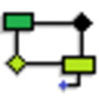
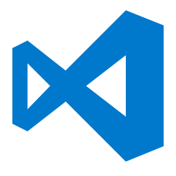

# Ferramentas

## 1. Introdução

Com o objetivo de assegurar maior organização, eficiência na comunicação e qualidade na produção de artefatos durante o desenvolvimento do projeto, foi elaborado um levantamento das principais ferramentas a serem utilizadas pela equipe nesta entrega 2 do projeto. A Tabela 1 apresenta essas ferramentas, juntamente com suas finalidades e aplicações previstas ao longo da execução da entrega 2 do projeto.

## Participantes

Todos os participantes do grupo participaram da elaboração das ferramentas e estão descritos na tabela a seguir, em ordem alfabética:

Tabela 1: Participantes da elaboração das ferramentas

| Matrícula | Aluno              |
| --------- | ------------------ |
| 231027032 | Arthur Oliveira    |
| 190042303 | Carlos Nascimento  |
| 231037665 | Daniel Nascimento  |
| 222006650 | Davi Sousa         |
| 231026699 | Eduarda Rodrigues  |
| 231037692 | Isabella Choukaira |
| 231035455 | Leticia Jesus      |
| 200067095 | Lucas Avelar       |
| 231038303 | Yan Aguiar         |
| 231012316 | Yasmin Nascimento  |

## Ferramentas

<b>Tabela 1</b> - Ferramentas Utilizadas na entrega 2

|                        Logo                        |     Ferramenta     |                                       Finalidade                                        |
| :------------------------------------------------: | :----------------: | :-------------------------------------------------------------------------------------: |
|          |      BrModelo      |                  Criação de diagrama de Entidade Relacionamento - DER                   |
|          |       Canva        |                        Criação de slides para as apresentações.                         |
|           |      ChatGPT       |                           Ferramenta de consulta de dúvidas.                            |
|           |      Docsify       |                          Criação das páginas de documentação.                           |
|                 |      Draw.io       |                       Produção de diagramas lógico e de classes.                        |
|             |       GitHub       |    Organização, versionamento e documentação de artefatos produzidos para o projeto.    |
|         |    Google Docs     | Ferramenta para a primeira versão da escrita dos documentos necessários para o projeto. |
|  |  Google Planilhas  |               Criação de planilhas relacionadas ao cronograma e horários.               |
|                 |        Miro        |                  Criação de diagramas, fluxogramas e esquemas visuais.                  |
|               |       Teams        |                           Realização e gravação de reuniões.                            |
|             | Visual Studio Code |                     Criação e edição dos arquivos de documentação.                      |
|         |      WhatsApp      |                        Comunicação do time e avisos de demandas.                        |
|           |      YouTube       |                            Hospedagem de vídeos produzidos.                             |

Fonte: <a href="https://github.com/leticialopes20">Letícia Lopes (2026)</a>

## Referências Bibliográficas

> 1. **BRMODELO.** brModelo Desktop. [S.l.]: brModelo, c2026. Disponível em: https://sourceforge.net/projects/brmodelo/. Acesso em: 15 abr. 2026.

> 2. **CANVA.** Canva. [Sydney, AU]: Canva, c2026. Disponível em: [https://www.canva.com/](https://www.canva.com/). Acesso em: 15 abr. 2026.

> 3. **OPENAI.** ChatGPT. [San Francisco, CA]: OpenAI, c2026. Disponível em: [https://openai.com/index/chatgpt](https://openai.com/index/chatgpt). Acesso em: 15 abr. 2026.

> 4. **DOCSIFY.** Docsify. [S.l.]: Docsify, c2026. Disponível em: [https://docsify.js.org/](https://docsify.js.org/). Acesso em: 15 abr. 2026.

> 5. **DRAW.IO.** draw.io. [S.l.]: draw.io, c2026. Disponível em: https://app.diagrams.net/. Acesso em: 15 abr. 2026.

> 6. **GITHUB.** GitHub Docs. [San Francisco, CA]: GitHub, c2026. Disponível em: [https://docs.github.com/pt](https://docs.github.com/pt). Acesso em: 15 abr. 2026.

> 7. **GOOGLE.** Google Docs. [Mountain View, CA]: Google, c2026. Disponível em: [https://www.google.com/intl/pt-BR/docs/about](https://www.google.com/intl/pt-BR/docs/about). Acesso em: 15 abr. 2026.

> 8. **GOOGLE.** Google Planilhas. [Mountain View, CA]: Google, c2026. Disponível em: [https://www.google.com/intl/pt-BR/sheets/about](https://www.google.com/intl/pt-BR/sheets/about). Acesso em: 15 abr. 2026.

> 9. **MIRO.** Miro. [San Francisco, CA]: Miro, c2026. Disponível em: [https://miro.com/pt/](https://miro.com/pt/). Acesso em: 15 abr. 2026.

> 10. **MICROSOFT.** Microsoft Teams. [Redmond, WA]: Microsoft, c2026. Disponível em: [https://www.microsoft.com/pt-br/microsoft-teams/group-chat-software](https://www.microsoft.com/pt-br/microsoft-teams/group-chat-software). Acesso em: 15 abr. 2026.

> 11. **MICROSOFT.** Visual Studio Code. [Redmond, WA]: Microsoft, c2026. Disponível em: [https://code.visualstudio.com](https://code.visualstudio.com). Acesso em: 15 abr. 2026.

> 12. **META.** WhatsApp. [Menlo Park, CA]: Meta, c2026. Disponível em: [https://www.whatsapp.com/?lang=pt_br](https://www.whatsapp.com/?lang=pt_br). Acesso em: 15 abr. 2026.

> 13. **GOOGLE.** How YouTube Works. [Mountain View, CA]: Google, c2026. Disponível em: [https://www.youtube.com/howyoutubeworks/](https://www.youtube.com/howyoutubeworks/). Acesso em: 15 abr. 2026.

## Histórico de Versões

| Versão |    Data    |            Descrição             |                     Autor(es)                      |                    Revisor(es)                     |
| :----: | :--------: | :------------------------------: | :------------------------------------------------: | :------------------------------------------------: |
| `1.0`  | 15/04/2026 | Criação da página de ferramentas | [Letícia Lopes](https://github.com/leticialopes20) | [Arthur Evangelista](https://github.com/arthurevg) |
