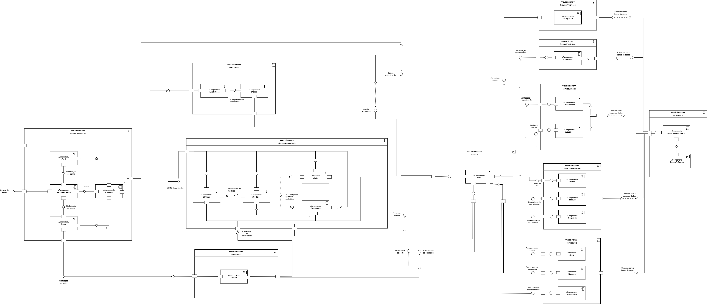

# ConhecendoRequisitos

**Código da Disciplina:** FGA0208  
**Número do Grupo:** 02  
**Entrega:** 02

## Alunos

| Matrícula  | Aluno              |
| ---------- | ------------------ |
| 23/1027032 | Arthur Oliveira    |
| 19/0042303 | Carlos Nascimento  |
| 23/1037665 | Daniel Nascimento  |
| 22/2006650 | Davi Sousa         |
| 23/1026699 | Eduarda Rodrigues  |
| 23/1037692 | Isabella Choukaira |
| 23/1035455 | Leticia Jesus      |
| 20/0067095 | Lucas Avelar       |
| 23/1038303 | Yan Aguiar         |
| 23/1012316 | Yasmin Nascimento  |

## Sobre

O **ConhecendoRequisitos** é uma plataforma educacional focada no ensino prático de Engenharia de Requisitos, desenvolvida no âmbito da disciplina de **Arquitetura e Desenho de Software** da **Faculdade de Ciência e Tecnologia em Engenharias da Universidade de Brasília (FCTE-UnB)**.

O principal objetivo do projeto é democratizar o acesso ao conhecimento em Engenharia de Requisitos, oferecendo uma abordagem mais leve, interativa e eficiente quando comparada a materiais tradicionais, frequentemente considerados extensos e teóricos.

A plataforma foi estruturada com base em **trilhas de aprendizado** e **microlearning**, permitindo que estudantes consigam aprender de forma gradual e adaptada à sua rotina. Além disso, o sistema propõe o uso de **desafios interativos**, **quizzes de fixação** e **feedback imediato**, promovendo maior engajamento e retenção do conteúdo.

## Screenshots da Segunda Entrega

### Diagrama de Componentes

### Diagrama de Implantação

### Diagrama Entidade-Relacionmento

## Há algo a ser executado?

( ) SIM

(X) NÃO

## Informações Complementares

Nenhuma informação complementar.

## Histórico de Versões

| Versão | Data  | Descrição            | Autor(es)                                                | Revisor(es)                                      | Detalhes da Revisão      |
| ------ | ----- | -------------------- | -------------------------------------------------------- | ------------------------------------------------ | ------------------------ |
| 1.0    | 23/04 | Criação do Documento | [Yasmin Nascimento](https://github.com/Yasm1nNasc1mento) | [Yan Matheus](https://github.com/Yanmatheus0812) | Documento inicial criado |
